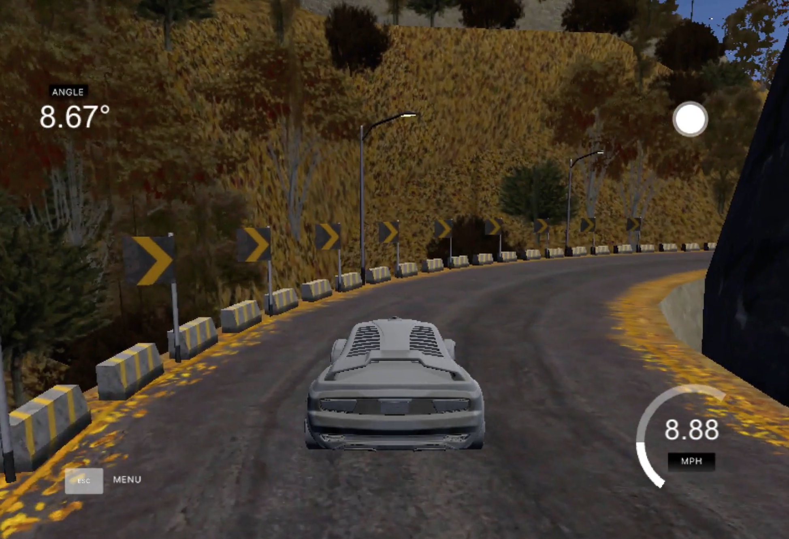
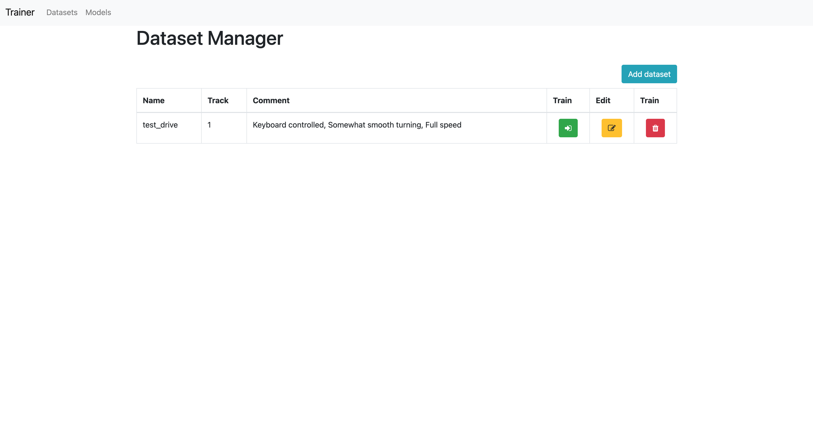
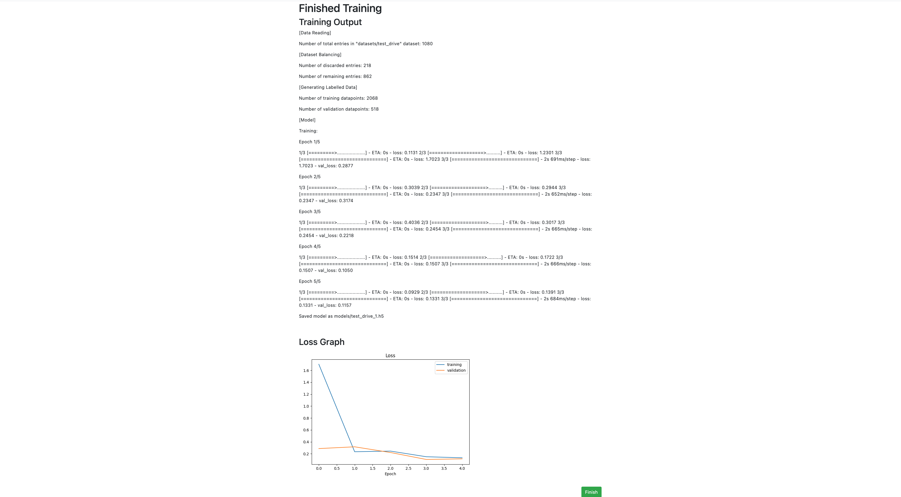

# Track Driver AI

**AQA A-Level Computer Science (7517) - NEA Project**

*Documentation for a system that controls a vehicle autonomously.*

| Name             | Rushil Ambati |
| ---------------- | ------------- |
| Candidate Number | 9037          |
| Centre Number    | 51337         |


------

## **Table of contents**

[toc]

------


# Analysis

## Background

Autonomous vehicles help us improve access to mobility. The objective is to increase the efficiency of how people move about - the ability to be productive in the time spent in transportation. The most important thing in this space is to save lives - preventing crashes that lead to injuries and fatalities. In the time you have finished reading this paragraph, somebody in the world has died in an auto crash.

After attending a lecture by Professor Amanda Prorok presenting her team’s work on her research on [cooperative driving in self-driving cars][1], I became interested in the methods used to develop autonomous vehicles (AVs). In Prorok’s setup, a test-bed of miniature vehicles drive on a looped track. Each vehicle is fitted with circuits to control the throttle and steering. Data from an external motion capture sensor is fed into a ‘planner’ which uses a set of deterministic algorithms to calculate driving commands for the vehicles. These commands are then transmitted to each vehicle simultaneously. This produces excellent results in the behaviour and interaction of the vehicles as the right algorithms will form optimal transport efficiency.


However, in my opinion, this configuration is unrealistic as connected autonomous vehicles (CAVs) in the future will likely not have their decision making be centralised on an external planner but rather be part of a decentralised network where individual vehicles act as nodes that control themselves with local information such as data fused from sensors mounted on the vehicle, paired with information about vehicles close by direct or via-infrastructure wireless communication. Most AVs on our roads are not connected for a variety of reasons - mainly because the infrastructure and standards surrounding Vehicle-to-Everything (V2X) communication are still in development. The idea of infrastructure-based autonomous navigation is largely restricted to specific use cases such as ground transportation at airports, park shuttles, or automated facilities due to its limited scalability and high cost.

The current mainstream approach to attempt to actualise AVs is to operate every stage in the pipeline locally.

AI is technology that solves problems autonomously by simulating human intelligence or consciousness. It is a great technological challenge to create an AI for autonomous vehicles due to the complexity of the environments where these systems will operate. There have also been impressive leaps forward in the cutting edge of the AV industry and AI research. Thus, I became curious as to how Autopilot as well as similar systems worked under the hood and so I took on extensive research into the field.

After understanding some of the approaches taken by Tesla and other organisations in the field to get a car to drive itself reliably in a variety of different environments, I wished to implement my own solution to the driving problem.


## Problem Statement

The problem being solved by this project is the driving problem, as discussed above.

The aim of this project is to create an artificially intelligent autonomous driving agent that will safely drive a vehicle around a track, which I reference as the ‘agent’ throughout this documentation.

I will also develop ‘Trainer’ and ‘Driver’ applications which provide easy-to-use interfaces for AI model generation and inference.


## Problem Decomposition

### Autonomy Levels

The [SAE autonomous driving levels][2] qualify the complexity of different ADSs.
A concise breakdown of each autonomy level is as follows:

> **Level 0** - “No Automation”
> Driver is in charge of all driving, but may be provided with some warnings about the environment (eg. frost signal)
>
> **Level 1** - “Driver Assistance”
> Driver must do all driving, but may be provided basic help in some situations (eg. emergency braking).
>
> **Level 2** - “Partial Automation”
> Driver must stay fully alert even when vehicle assumes some basic driving tasks such as acceleration, braking in limited situations (eg. Tesla Autopilot, comma.ai openpilot).
>
> **Level 3** - “Conditional Automation”
> Vehicle can take full control over acceleration and braking under certain conditions. Driver must always be ready to take over within a specified period of time when the ADS is unable to continue. 
>
> **Level 4** - “High Automation”
> Vehicle can assume all driving tasks under nearly all conditions without any driver attention, but a passenger must be present to take over when the ADS is unable to continue.
>
> **Level 5** - “Full Automation”
> No human driver required. Vehicle in charge of all driving tasks and can drive in all environments, and handle exceptions/failures without human intervention.

Operationally, there are clear differences between Levels 0, 1 and 2. Most ADSs in L1 come under driver assistance, and in L2 these are considered advanced driver assistance (ADAS). While full self-driving has remained unsolved to date, driver assistance systems have reached commercial success, enriching driving comfort and safety.

However the definition of ADAS is very broad, since technologies under this bracket may range from only hazard driving condition alerts or cruise control, all the way up to the current production ADSs such as the Autopilot example given above.

However beyond L2, there seems to be ambiguous differences in actual capabilities. Instead, the majority of the differences are in insurance - upwards of L2, the driver is not required to be as attentive as the previous level all the way up to L5 where they are not needed at all. It is very important that below L5, the ADS is designed with trust of the human driver in mind, since they must be ready to intervene or accept a control handover where required.

Fully autonomous L5 autonomous navigation in general environments has not been realised to date.
The reason for this is two-fold:

- Autonomous systems which operate in complex dynamic environments require models which generalise to unpredictable situations and reason in a timely manner.
- Informed decisions require accurate perception, yet most of the existing computer vision models are still inferior to human perception and reasoning.

These levels do not define the capabilities of a system. The level definition seems to be a mix of both its capabilities and how strict the requirement is for driver attentiveness.

Given that this particular set of autonomy levels is decided by an engineer organisation, it makes sense that these levels are separated in a way that would correlate to safety/trust in the ADS because the consequences of mistrust or lack of attentiveness on a non-L5 autonomy on physical roads could be very severe.

### Stages of the Driving Problem

The driving problem can be broken down into three stages, each building on top of the previous.

Below I have described each stage, the general ODD that stage will can operation in, as well as a list of major sub-problem(s) that must be considered in order to obtain a solution for that particular stage.

#### Static

Considering the driving problem when you are the only car on the road.

1. Lane-keeping

#### Dynamic

The static problem, as well as detecting other objects in real-time that are not in the static map and planning appropriate actions. These objects, such as other human driven cars or pedestrians, are not fixed and may move, so you have to predict what these objects will do and then plan accordingly. For this, models of other agents’ behaviours are needed.

2. Detection of road signs
3. Detection of other vehicles
4. Detection of other pedestrians
5. Detection of traffic lights

#### Counterfactual

All of the factors from both the static and dynamic problems, as well as including your influence on other people. Solved potentially with reinforcement learning on the world (discussed later). This works only because the other agents are humans.

Cracking L5 autonomy is a more philosophical level problem. It is far more difficult than the other two solely due to the fact that human agents, including other drivers, cyclists and pedestrians, are unpredictable by nature.

6. Detection of indicators or communication from other cars or pedestrians.

Vaguely mapping these three stages to both the Autonomy Levels and ODDs described above:

- A Static implementation covers all of Track driving and can bring autonomy up to around L2
- Including Dynamic factors allows the system to cover a much more expansive ODD like Highway and even Urban driving, up to and including L4
- Solving the Counterfactual problem and communication overall is what I think will let autonomous vehicles be able to reach Level 5 autonomy in the long term future.

### Simulation


A simulator is a synthetic environment created to imitate the world. Sensors are simulated and can directly work with them. A control interface can also be emulated, like drive-by-wire in a real car.

Historically, development of AVs has been solely physical, without the use of sophisticated simulation.

Without using simulation, there are two primary methods to achieve reliable autonomy.

The first is rolling out AVs in constrained environments. Companies such as Waymo or Cruise employ this strategy to map a particular area to a very high definition and then build ADSs that function with high precision in a particular region. Furthermore, this allows companies to achieve higher autonomy levels within a defined geographical area, but does not necessarily work towards a high level generalised system.

The other more curious approach is to build models which are able to reason and learn with little data. A category of algorithms that could be employed for this is Reinforcement Learning, discussed later in the approaches. However, this has not materialised to any significant extent in research or industry yet.

Nowadays, there is potential to access far more compute power; even enough to the point where simulations can be created and utilised to assist in the development of real ADSs.

#### Fidelity

Simulations can have varying levels of detail and realism.

- High Fidelity
- 
  - Digitising vast areas of the world in virtual space for photo-realism and material-realism.
  - Accurate models of vehicle, sensors and other agents.
  - Very computationally and financially expensive
- Low Fidelity
- 
  - Generate only feature representation of interface between perception and planning, no need to render anything
  - Only assists in improving planning/control but not perception

#### Advantages

The main advantage of simulations are that development can be made a no-consequences environment. Apart from time, there is no repercussion for crashing your vehicle, and no time, effort or money is spent on repairing the car - since the simulation can simply be reset.

Simulation can also be used for testing rare and edge cases and baseline data. With simulation, you are able to test ADSs on:

- A variety of world scenarios, such as
  - Traffic
  - Climate
  - Visibility
  - Shadows
  - Road environment
  - Driver behaviour
- Multiple sensor suites, to figure out
  - How many sensors do I need?
  - Which sensors should I use?
    - Where on the car should they be?
- Many scalable random permutations
  - In simulation, it is possible to create just about any traffic scenario that a driver could encounter in the real world.
  - Easy to obtain data sets, therefore also easier to train sufficiently accurate neural networks. This is particularly useful for data driven methods such as Machine Learning, since the machine can learn from a huge variety of driving scenarios.
    - This training can even be done in parallel (with multiple simulations running at the same time), saving money.
  - Using simulation for this avoids the need for a fleet of cars on the road with safety drivers for long periods of time, saving money.
- Provides easy interfaces and utilities for the perception and planning stages respectively.

All of the above helps developers to both expand ODD and improve reliability in different unseen scenarios. It also allows easy identification of boundary cases for the ADS.

#### Disadvantages

Fundamentally, simulators are not the same as reality. This leads to residual risk, caused by the ‘Reality Gap’. This means that systems developed in simulation are not very easily ported to reality and retain its autonomy level. This is because:

- Safety models are vastly different between simulation and real life.
- The models of a simulator will not necessarily match up to reality, so the parameters in the ADS will require tuning to perform well on a physical vehicle. These models could include:
  - General physics
  - Sensors
  - Controls
  - Agent behaviours

The ‘Reality Gap’ consists of three major problems:

- Domain Adaptation Problem
  - Simulators will never match up to the real world, so even if you mange to obtain a perfect driver in a simulation environment it does not necessarily mean that the performance seen will map exactly to performance in reality. This is an open issue in a sub-field of Artificial Intelligence focused on Transfer Learning.
  - This problem is especially significant if using lower fidelity simulation.
  - Data Augmentation helps fix this issue.
- Simulation Fidelity Problem
  - The ideal sensors mean there is no perception error. However, when a model trained on ideal input data is transferred to the real world, there will be mistakes because in reality, sensors are not perfect and will provide noisy data.
  - This may adversely affect the performance of the ADS, because the planner must be robust in the presence of such errors.

- Simulation Saliency Problem
  - Not all permutations of traffic scenarios will necessarily be something a human would be able to negotiate.
  - Unclear what situations should be considered and what situations should be given tolerance.

Simulation is a powerful tool and it will allow ADSs to get most of the way to reliability by covering cases that are unlikely to occur in reality, in advance. Thus, they are valuable in AV development, especially in the aim of reducing the risk in using an ADS.

## Theory

### Computer Vision

Before I consider each of the planning approaches, it is useful to consider that the task of autonomous driving heavily depends on Computer Vision, allowing artificial systems to gain a high-level understanding of an environment (implicitly or explicitly). This is a very broad field that encompasses many techniques, including:

- Object recognition (for other vehicles, cyclists or roads)
- 3D pose estimation (useful to model pedestrians)
- Environment mapping/Simultaneous Mapping and Localisation

These techniques tend to involve analysis of data from sensors such as cameras (images) as well as point cloud data from LIDAR.

### Machine Learning

I have discussed previously at a high level what Machine Learning techniques and Neural Networks are, but to provide further clarity I will describe how they work with examples in the context of Autonomous Vehicle development.

Machine Learning (ML) is an application of AI that allows systems to improve from experience/data without explicitly being programmed how to execute a task.

ML algorithms are often categorised as follows:

- Supervised learning develop predictive models based on data input and output. It takes a known set of input data and known responses to the data (ground truths) and then trains a model to generate reasonable predictions for the response to new data. It improves by comparing its output with the correct intended output to calculate an error, and modify the model accordingly.
- Unsupervised learning is used when the data is not labeled. The system is able to infer a function to describe patterns or structure in the unlabeled data.
- Reinforcement learning is a method that interacts with an environment (such as, in this case, a driving simulator) and produces actions, discovering errors in a process called exploration. Over time, they automatically determine the ideal behaviour to maximise performance according to a reward function.

#### Neural Networks

These ML algorithms often utilise [artificial Neural Networks][4], which is a data structure inspired by the structure of biological neurons composed of nodes that are connected to nodes in the following layer with weights, where a greater positive value denotes an excitatory connection and negative values denote inhibitive connections.

Most commonly, feedforward neural networks structured as distinct layers that begin with an ‘input layer’ and terminates in an ‘output layer’, where the values input to the first layer are multiplied by the weights successively to eventually produce values in the output layer that represent some signal.


Initially, the parameters in the network are randomly set. This produces random and mostly meaningless outputs given any input. In order for the network to ‘learn’, the network compares outputs with a provided correct answer (from the labelled data in supervised learning). A 'cost function' is used to evaluate an error value for the network.

The results of the cost function are then ‘backpropagated’ across all nodes and connections to adjust the parameters, modifying initial outputs based on the degree to which they differed from the target values.

I will not go into further detail on the inner workings of network optimisation algorithms as I do not implement this algorithm myself, but as a general idea, it is a technique used alongside a cost function to improve network performance. It is mostly based on high level multivariable calculus, using concepts such as gradient descent and partial derivatives of a cost function with respect to weights and biases to calculate the amount to change each parameter by.

A more thorough explanation of optimisation algorithms for neural networks can be found at a variety of places online. There are many other components to neural networks, including activation functions, the vanishing and exploding gradient problems, and disagreeing machines.

Activation functions such as sigmoid, softmax or rectified linear unit are used in many of these network architectures to provide normalised activation values. Most commonly, these are applied in the final layers of the network.

Once trained, these networks can be used to predict an output, such as a steering angle. This process of obtaining outputs is called ‘inference’. In a simulation context, a neural network that is given real-time input from its virtual sensors will ideally eventually learn to control the vehicle reliably in most situations.

#### Deep Learning

Deep Learning is a subset of ML methods that use much larger networks with many nodes and thus many parameters, known as “deep NNs”. Having so many weights, these networks have a much larger capacity to learn, allowing applications to much more sophisticated and extensive data structures - especially with images and audio.

Networks with too little capacity may not be able to learn the problem, and thus not be able to interface with larger input types.

These networks are especially powerful when paired with large quantities of data.

#### Convolutional Neural Networks

[CNNs][5] are a class of deep feedforward neural networks that are most commonly applied to analysing visual imagery. They ‘learn’ in the same way as the general backpropagation method described above, but utilising filters (or ‘kernels’).

I will provide a brief overview below, mostly condensed from these [Stanford university lecture notes][6] and this [blog post][8].

These filters look at regions of an input image with a defined window size and map it to some output. It then slides the window by some defined stride to other regions, covering the whole image. Each convolution filter layer thus captures the properties of this input image hierarchically in a series of subsequent layers, capturing the details like lines in image, then shapes, then whole objects in later layers. This process is called a “convolution”, hence the name of the architecture. Convolutions preserve the spatial relationship between pixels by learning image features using small squares of input data. The product of this operation is called a “feature map”.


Spatial Pooling (also called subsampling or downsampling) reduces the dimensionality of each feature map but retains the most important information. Spatial Pooling can be of different types: Max, Average, Sum etc.

In the case of Max Pooling, we define a spatial neighborhood and take the largest element from the rectified feature map within that window. Instead of taking the largest element we could also take the average (Average Pooling) or sum of all elements in that window. In practice, Max Pooling has been shown to work better.


The purpose behind Pooling is to progressively reduce the spatial size of the input representation. Pooling:

- Makes the input representations (feature dimension) smaller and more manageable.
- Reduces the number of parameters and computations in the network, therefore, controlling overfitting (discussed below).
- Makes the network invariant to small transformations, distortions and translations in the input image (since we pool as an average or maximum for example).
- Helps us arrive at an almost scale invariant representation of our image. This is very powerful since we can detect objects in an image no matter where they are located.

These convolutional layers are commonly followed by fully connected (Dense) layers where each node is connected to all nodes in the following layer. The overall network is architected as such to allow features extracted from the CNN portion to be classified or regressed accordingly.

The convolutional layers are intended to handle feature engineering for the fuly connected layers.


## Research

In order to further understand what the driving problem is, the potential ways of solving it, and the theory underpinning it, comprehensive research had to be conducted. Many algorithms exist in the autonomous vehicle AI software space, all with varying levels of complexity and each with their own advantages and disadvantages.

More empirical overviews extracted from my research can be seen in the [Design](#Design) stage below.

### Existing Driving Systems

AVs have been an open research field since the 1980s, so I began by looking at research papers in the initial stages of development of these technologies.

#### ALV

The earliest paper I came across for an Autonomous Vehicle was by Matthew Turk where he created the ALV (Autonomous Land Vehicle). The ALV used a vision system named [VITS][14].

VITS utilised a single colour (RGB) camera as sensor input and segmented the road by colour using linear algebra techniques (dot product of the red and blue colour channels of each pixel), which relies on an assumption that the colour of the road surface and the sky/surroundings being generally quite different.

Once VITS maps out what region of the image is road and what is not, it uses a modular pipeline to estimate a trajectory for the ego vehicle. ALV does this by mapping the boundaries from image space to world space. Then, this information is fit into a control algorithm, outputting a steering angle. The ALV was able to run its first demo at 2 mph. Note that this only controlled lateral control (steering) but not how fast the vehicle moved (throttle, or longitudinal control).

However, the failures of the ALV are clear. Firstly, the vehicle is only able to traverse its track at 2 miles per hour which is very slow, however this is forgiven in that the computational power available to Turk in the 80s is far different to what we have access to now. The main failure is that there are many scenarios in which the colour of the road and the colour of the surrounding environment are similar, such as in deserts or in dirt tracks surrounded by trees. This means that, in these difficult environments, VITS is less reliable and more prone to trajectory calculation error and therefore more likely to cause an overall failure. The ALV was later improved to add adaptive algorithm parameter tuning, but this did not improve the overall performance by a significant amount.

Developments in AVs for a few years after the ALV was created seemed to employ similar vision and motion planning algorithms.

To summarise, the ALV:

- is Vision based (only takes camera input)
- uses a hand-written planning algorithm

#### ALVINN

What is most interesting to me about this approach is how starkly different it is to all of its predecessors. Dean Pomerleau built the [“Autonomous Land Vehicle in a Neural Network”][15]. Overall, this improved both the robustness and the adaptability of the state-of-the-art AVs of the time.

Consider the ALV. We can abstract the steps of operation of the ALV as composing parts of an overall function; one that takes an image as input and outputs a steering angle value to keep the vehicle centred on the road. The ALV team chose to break apart this function into the discrete steps covered above - as a modular pipeline - however we could choose other ways to map images to steering angles.

Around the time of Pomerleau's research, Geoffrey Hinton released a paper on mathematical models loosely based on how our biological brains work: Neural Networks (NNs), as well as a novel method to allow artificial NNs to learn from data and errors: [backpropagation][16]. Pomerleau considered the application of this structure to AVs: instead of manually programming all of the steps to map images to steering outputs as the ALV team had done - what if we could use an Artificial Neural Network to ‘learn’ the whole pipeline?

A high level description of what Pomerleau set up:
A three layer NN, with which takes an image as input, processes through one hidden layer, and comes out to some output units, each representing a particular steering angle. Then, he began ‘teaching’ his network from human driving data using Hinton’s backpropagation. Over training with more data, the weights in this network formed in a way that the steering angles computed by it would converge towards the human driving data for that input image, and the idea was that eventually ALVINN would be able to drive like the human it was trained from.

It is incredible that a structure as seemingly simple in operation as a feedforward neural network is able to steer around a track just from images and human steering angle data. It is also both impressive and convenient that this network is able to learn features such as straights and turns on a road image without hard declarations or definitions of them.

Pomerleau put this architecture into practise on a vehicle called NAVLAB1, a van with a roof mounted colour camera and holding a computer running a trained model of the neural network. This vehicle ran on a version of ALVINN’s architecture that had very few nodes. It took 30 by 32 pixel colour images, so the input layer had 960 nodes in the input layer. Each of these nodes was connected to 4 nodes in the singular hidden layer, which are present to pick up features. These then went out to 30 output nodes. In total, this means there are 3960 weights (parameters) in this ALVINN1 network. NAVLAB1 was able to travel at a top speed of 1 mph.

The next version of ALVINN - version 2 - made improvements both in the sensor suite to form a new vehicle, NAVLAB2. This changed the network to include an extra input, from a range finder - what we now know as a depth sensor. The width of the hidden layer is increased by over 7 times, now with 29 nodes. The output layer has 45 nodes now, increasing the resolution of the steering angle, and allowing for more fine adjustments in the control part of the stack. Using this, he was able to execute a transcontinental traversal of America: “No Hands Across America ‘95”, 98% autonomously, using only a camera as sensor input. This is a massive leap from both the ALV and ALVINN1.

This is an early instance of a method called Imitation Learning (IL) on an artificial neural network - as it begins to clone the behaviour of the data it is ‘shown’. IL is a supervised learning method since the network is given data to compute and correct an error from.

ALVINN:

- is Vision based, like the ALV
- is the first ADS to make use of Machine Learning (ML) on artificial NNs rather than a modular hand-written planning pipeline
- used relatively shallow 3-layer NNs

#### DAVE-2

After this historical dive, I looked at research papers released by companies in the AV industry now, to gauge which methodologies are currently being used - to me these indicated which ones must have been most successful to the engineers in those teams.

In [this paper by NVIDIA, “DAVE-2” is developed][17], providing a well structured, more modern pipeline for training and inference. This system is based on ALVINN but is updated to fully utilise the computational power made available more recently.

DAVE-2 uses a CNN to comprise a monolithic learning system. This takes in images from front facing cameras and maps them to steering commands. In NVIDIA’s real implementation on a vehicle, this turned out to be surprisingly powerful and required relatively little training data from human drivers to learn to drive in an Urban operational domain, even without lane markings.

Since this is E2E, the network automatically learns internal representations of the processing steps and useful scene features such as lanes, pedestrians or other vehicles. These do not have to be explicitly defined, and therefore optmises the processing steps, which improves long term performance.

In NVIDIA’s model, they reached a good enough accuracy such that their self-driving car could run in traffic and in parking lots without crashing despite only being given one camera’s input.


For data collection, NVIDIA drove on a wide variety of physical roads in a diverse set of lighting and weather conditions, mostly across the USA.

NVIDIA used simulation mixed with real-world training data to test their system prior to implementing it in an actual vehicle.

### Existing Trainer/Driver Systems

From what I found on my research, there are no openly available applications with similar functionality to the Trainer or Driver I wish to implement.

Thus, these applications will have to be designed mostly from scratch.


## Client Discussion

In order to determine the objectives of the system, I considered the needs of a client for the system - one of the principal engineers at FiveAI. I asked them which features they would like to be implemented in my AV and Trainer system.

The results of the exchange has been summarised in the table below, along with a priority label column.


## Objectives

| Objective                                                    | Method                                                       | Importance |
| ------------------------------------------------------------ | ------------------------------------------------------------ | ---------- |
| The system must be able to drive the vehicle like a human    | System will be able to control the vehicle autonomously in real-time | *MVP*      |
| The system must be able to keep the vehicle centred on the track | System will output the optimal steering command given the vehicle’s position on the track | *MVP*      |
| The system must provide an easy to use interface and be accessible | Trainer and Driver will be intuitive and abstract complexities from the user | *MVP*      |
| The system should be able to drive on a variety of different simulated tracks | System will be generalised enough to drive on multiple tracks in the simulator | *EXT*      |
| The system should provide an aesthetically pleasing interface | Trainer and Driver will be designed such that it is easy to navigate and use | *EXT*      |

(*MVP* = Minimum Viable Product, *EXT* = Extension)


------

# Design 

## Preliminary Considerations

### Operational Design Domain

FiveAI writes in [their blog post on AI safety][3]:

> One of the key concepts in autonomous driving is that of the ODD, which is defined as the “operating conditions under which a given ADS is specifically designed to function”. The ODD forms a high level specification in which the ADS is designed to operate safely. This includes, for example, the types of environmental conditions it will see, the types of traffic and the roadway characteristics.

The larger/wider the ODD, the more extensive its capabilities since it is able to perform well in a wider range of driving scenarios. The ODD of a simulated system can never be the same as reality and is always limited since in reality there are an infinite number of possibilities that a driverless vehicle can run into while driving.

Here I will consider two brackets of driving domains, which I have labelled ‘Track’ and ‘Urban’. These are not universal definitions for these domains.

#### Track


- A road that loops on itself, like a racetrack
- There are no other road users:
  - No pedestrians
  - No cyclists
  - Only one vehicle, which is the ego vehicle (the vehicle being controlled).
- No regional speed limit
- No road signs
- No traffic signals
- No junctions or alternate paths to take
- 1 or 2 lanes

#### Urban


- A network of roads in a metropolitan area such as a city or town
- There is traffic from other road users:
  - Drivers in other vehicles
  - Pedestrians
  - Cyclists
- Road signs
- Traffic signals
- Roads can be comprised of many lanes in either direction (typically 1 or 2)
- Roundabouts, junctions etc.

Another major domain is highway driving, which is driving at a higher speed on straight roads with many lanes, exits and joins. This environment will not be considered in this project, but is relevant to real AVs.

In order for an ADS to progress from track driving (smaller ODD threshold as there are fewer factors to consider) to urban driving (larger ODD threshold because the environment is much more complex and there are many more factors to consider), plans must be made on how to expand the ODD.

The biggest jump in capabilities from an extension of the ODD in my opinion is moving into an environment where there are other agents present, since the objective becomes driving predictably to avoid confusing those travelling alongside the ego vehicle.

### Simulators

There are many free and/or open source simulators available online for autonomous driving research. After searching, I narrowed down my choices to two simulators, each for different environments.

#### Udacity

[Udacity's Self-Driving Car Simulator][10]

- Built in Unity game engine
- Lower fidelity
  - Relatively lightweight to run
- Fixed, not very configurable
  - May limit ODD
- Open Source
  - Modifiable
- Provides one ego vehicle
  - Racing style car
  - Hard speed limit of ~30mph

- Provides three static track environments of increasing complexity
  - `track_1`
    - 
    - One lane
    - Short loop track
    - Wide turns
    - No inclines or declines
  - `track_2`
    - 
    - One lane
    - Medium non-loop track
    - Sharper turns
    - Shallow inclines and declines
  - `track_3`
    - 
    - Two lanes
    - Long loop track
    - Sharp turns
    - Steep inclines and declines
- Provides one-click recording and saving of driving data
  - Packs image files in a well structured folder and CSV file which can be easily read by a program.
- Provides straightforward communication interface for perception and control
  - Uses sockets
    - Allows for server-client communications
- Provides a basic suite of sensors
  - One, two or three colour cameras

#### CARLA

[CARLA][11]


- Built in Unreal Game engine
- High fidelity
  - Resource intensive
- Highly configurable and modular architecture
- Open source
  - Modifiable
- Provides 30+ vehicles
  - Ranges from cars to bikes
  - No speed limit
- Provides 10+ dynamic urban town environments with
  - Other simulated drivers
  - Pedestrians
  - Cyclists
  - Traffic lights
  - Road signs
  - Buildings and metropolitan scenery
- Does not provide one-click recording of driving data
- Provides more sophisticated communication interface for perception and control
  - Uses API
  - More built with server/client architecture in mind
- Provides massive sensor suite, including
  - Colour cameras
  - Depth sensors
  - LIDARs
  - Radars
  - Ultrasonic sensors

#### Choice

For this project, I am choosing to use only the Udacity simulator since I am targeting a solution at the static driving problem which better suits the track environments provided within the simulator. It will also allow for systems with fewer computational resources to run this simulator. This simulator also provides a GUI interface and automates processes such as recording and saving of driving data, which improves user experience.

Although the Udacity simulator is significantly less extensible than CARLA, it will fit my purposes far better than CARLA without having to do extensive configuration.

Also, for the client, this simulator is significantly easier to navigate, use and control than CARLA, which is more aimed towards researchers and does not have an easy-to-use interface, which inhibits one of my objectives.

#### Data Collection

Udacity’s simulator includes a “Recording” function which allows for automatic saving of driving datasets from within the application itself.

The datasets are stored in a folder selected within the UI of the simulator. The name of the folder is set prior to recording in the simulator.

The structure of the data folder is as follows:

```
├── IMG
│   ├── center_YYYY_MM_DD_HH_MM_SS_sss.jpg
│   ├── ...
│   ├── left_YYYY_MM_DD_HH_MM_SS_sss.jpg
│   ├── ...
│   ├── right_YYYY_MM_DD_HH_MM_SS_sss.jpg
│   ├── ...
├── driving_log.csv
```

(The date format in the images above expanded is: ` Year_Month_Date_Hour_Minute_Second_Milisecond`)

##### Images

The `jpg` files in the `IMG` folder are all images from driving. The filenames correspond to the cameras from which the image was taken and the timestamp. Each image is `320×160` pixels in size. 

A sample of the images are below (these are from across track 1):


##### Driving Log

The `driving_log.csv` file is the container for recorded values for driving.

The format of this table is as follows (provided with some example data):

| Path of Left Camera Image            | Path of Centre Camera Image        | Path of Right Camera Image          | Steering Angle | Throttle    | Braking | Speed      |
| ------------------------------------ | ---------------------------------- | ----------------------------------- | -------------- | ----------- | ------- | ---------- |
| `center_YYYY_MM_DD_HH_MM_SS_sss.jpg` | `left_YYYY_MM_DD_HH_MM_SS_sss.jpg` | `right_YYYY_MM_DD_HH_MM_SS_sss.jpg` | `-0.112107`    | `0.9909242` | `0`     | `30.03807` |

*The paths from the simulator may not necessarily be relative to the driving log so this must be taken into account when manipulating the datasets on disk.*

### Perception

Perception systems in an autonomous vehicle can be composed of a variety of sensors. There are two major approaches in industry when it comes to putting together a sensor suite on an AV.

#### Vision

Vision sensors primarily pertain to cameras. This can range from just one singular camera (known as monocular vision) up to an array of cameras placed strategically around the car.

Vision systems are currently most useful in ADAS since they can be mass produced. An example of a company that uses this approach is Tesla with their Autopilot line.

A binocular setup is comparable to how humans solve the driving task.

Advantages:

- High resolution of information
  - Lots of detail can be inferred from it, about texture and even distance
- Colour data
  - Can infer information about the colour of a traffic light, or type of a speed sign
  - This makes it the only sensor discussed here that allows to solve the task without any additional sensors
- Feasible to collect data at scale and learn from it
  - Allows coverage of more edge cases and helps with generalisation of the system
- Roads are designed for human eyes, and cameras are the closest sensor to our biological sense counterpart
- They are relatively cheap and ubiquitous when compared to LIDAR and Radar
- Does not have to rely on good mapping of regions

Disadvantages:

- Inaccurate depth information
  - How to perceive 3D world from 2D image?
  - Human vision is not very accurate at this either, so may not be particularly significant?
  - Can be segmented by depth using Machine Learning
- Not accurate without a lot of data
- Not explainable or consistent in all conditions, can be affected by
  - Harsh weather
  - Bad lighting

#### Point Clouds and Maps

Mapping can be used as an input to the planning systems. Today, differential GPS in combination with inertial measurement units (IMU) allows for localization at an accuracy of 5cm in good conditions, enabling the use of detailed lane-level road maps (HD maps) and providing redundancy for noisy vision-based localisation.

LIDAR, which stands for Light Detection and Ranging, illuminates objects with lasers and then measuring the time of reflection with a sensor. By placing this on top of an autonomous vehicle, we can get a 3D point cloud view of all objects and how far they are from the ego vehicle. This produces a high resolution map of the surrounding environment.

ADSs that incorporate LIDAR tend to take a very particular constrained set of roads, mapping them extensively and then using the most accurate sensors available, and currently that is widely considered to be LIDAR. Then this highly extensive and accurate data is used to localise the ego vehicle effectively and predict a trajectory from that.

These are the systems that may be able to reach L4 autonomy in the current day and age. Examples of companies using this approach include Waymo and Cruise.

Advantages:

- Highly accurate depth information
- High resolution compared to radar
- 360 degrees of visibility
- Visibility in adverse lighting conditions
- Highly consistent, as Machine Learning is rarely involved
- Reliable and explainable
  - If the system fails, it is easy to understand why (not so true for ML methods)

Disadvantages:

- Very expensive
- Most approaches using these technologies are not Deep Learning based so they do not improve over time
  - This is because Machine Learning techniques require lots of data, and in physical systems this needs large fleets of cars

#### Other

##### Radar

A ranging sensor like LIDAR, but that uses radio waves instead of laser light. These sensors are quite common in modern cars.

- Cheap
- Does very well in extreme weather
- Low resolution
  - Cannot achieve a high degree of autonomy on its own, best used in tandem with other sensors 
- Most used automotive sensor for object detection/tracking
- No colour

##### Ultrasonic

A ranging sensor that uses sound waves. These sensors are also quite common in modern cars, mostly used for parking distance detection and warning.

- Able to see through objects unlike LIDAR
- Work normally in bad weather
- Relatively inexpensive
- Work well in fog and low light conditions unlike cameras
- No colour
- Short field of view
- Less accuracy compared to LIDAR
- Do not work very well at fast speeds, while LIDAR and Radar both do

##### Sensor Fusion

The idea behind sensor fusion is where all of these perception subsystems work together to form an entire picture of the environment. This way we are able to accumulate the advantages of each sensor. We can also use sensors that cover the same regions as redundancy to ensure further trust in our data.

In all of these perception systems in any ADS pipeline below L5, the human is the failsafe. Full trust should never be put in any physical sensor.

### Planning

Existing approaches to self-driving can be roughly categorised into modular pipelines and monolithic end-to-end (E2E) learning approaches.

The basic idea is to map sensory input (eg. images from camera sensors, point clouds from LIDAR sensors) to control signals (steering angle, throttle/brake).

Different approaches taken by industry are outlined in [this thread by Vladimir Haltakov][12].

#### Modular Pipeline

The modular pipeline is the standard approach to autonomous driving in industry.

Modular pipelines are systems where engineers construct every step of the decision making process in the ADS. The key idea is to break down the complex mapping function from high-dimensional inputs to low-dimensional control variables into modules which can be independently developed, trained, and tested.

Generally, engineers will fit as much sensors as possible on the car, build high-definition maps of the environment and throw in lots of compute power. This is sometimes known as the “Everything that fits” approach.

The strategy here is to find the fastest (and most expensive) way to self-driving, usually directly aiming towards L5.

For example, these modules could include (in order of the pipeline):

1. Low-level perception
2. Scene parsing
3. Path planning
4. Vehicle control

There are many ways to modularise a self-driving stack and other or more fine-grained configurations are also possible.

Existing approaches typically leverage:

- Machine Learning to extract low-level features or to parse the scene into individual components
  - Deep Neural Networks
  - Convolutional Neural Networks
- Classical State Machines, Search Algorithms, Control Models for path planning and vehicle control
  - Proportional Integral Derivative Control
  - Model Predictive Control

Advantages:

- They provide human understandable representations for information such as detected objects or drivable area
  - This allows for engineers to gain an insight into failure modes of the system
- Easy parallelisation of development
  - Different teams can work on different aspects of the driving problem simultaneously
- Easy to integrate prior features of the driving problem at higher ODDs into the system, such as
  - Traffic laws that are explicitly enforced in the planner
  - Knowledge on vehicle dynamics such as friction and traction
  - Information that is more difficult to hand-specify such as the appearance of pedestrians can be learned from large annotated datasets
- Lots of sensor redundancy improves safety
- Fast development, straight to L5

Disdavantages:

- Human designed intermediate representations of driving and driving state are not necessarily optimal
- Modules are validated independently of one another, meaning residual wasted compute
  - For example, an object detection module may not be informed about the importance or relevance of each object in the scene, thus wasting capacity on irrelevant entities
- Does not cover edge cases well
- Generally very expensive to develop and produce
- Difficult to scale
- Generally requires manual feature extraction

#### Monolithic Learning

These methods allow developers to launch very quickly, but is not necessarily the safest. It does, however, provide the fastest feedback loop and most data.

They are cheap and scalable, but in a way utilise end-user testing on CV/ML algorithms. It is also not clear yet if these methods can easily scale to L5.

These approaches are often called "Pixel to Peddle” because they are generic models, often based on Neural Networks, that take in an observation and map them to actions. The network parameters can be learned by two main methods: imitation learning and reinforcement learning.

##### Imitation Learning

This method works on the basis of using neural networks to clone driving behaviour. The parameters (or ‘weights’) of the network eventually converge towards the behaviour of a ’teacher’ who demonstrates what driving decisions to make to this agent. This method is also known as “Behavioural Cloning” for this reason.

To implement an Imitation Learning approach, the following is required:

- Driving datasets in a similar or identical form to the perception systems used during inference
- Labels for the data in the dataset that correspond to the control signals the network will produce as outputs
- A neural network, as well as training algorithms to learn the weights in the network.

For example, in my case - using a vision based perception system, dashcam video may be used as data to train my model. Each frame or image in this vision dataset steering should be labelled with an angle/throttle value.

I plan to use the first track (one lane, soft turns, flat) as a training/validation data source, and then test on the second track (two lanes, sharp turns, ups & downs). Alternatively, I will train on the second track and see if it's able to stay in one lane instead of drifting between the two.

Advantages:

- Very fast training (good accuracy, low time)
- Doesn’t need that large of a data set
- Relatively simple - supervised learning

Disadvantages:

- Human error means imperfect data so Neural Network will never be close to perfect
- Also means the agent fundamentally cannot become superhuman
- Allows NN to do both feature extraction and inference

##### Reinforcement Learning

[This area of Machine Learning][13] is concerned with agents interacting with an environment in order to maximise some set reward objective. It is a different paradigm of ML altogether to Imitation Learning discussed above. 

This depends on exploration of the world and requires little data to train.

Doing this in real-life is likely not possible, so simulators are commonly leveraged for RL approaches.

Advantages:

- Has potential to be a far better result in the end
- Doesn’t require human in the loop for training, or a dataset
- Avoids human bias being incorporated into the model
- Has potential to be more robust than a system trained via supervised learning
- May generalise better in the long term

Disadvantages:

- Takes a huge amount of trial and error, and hence also a massive amount of computational time to reach the same level of accuracy (when compared to Imitation Learning)
- May not obtain predictable driving until far into long term of learning period
- Difficult to define ubiquitous reward function for ‘good driving’

### Control

Machine Learning systems output control commands such as a steering angle or throttle.

Modular systems may require some separate control subsystems. Common controllers include:

- Proportional Integral Derivative (PID) Controllers
- Model Predictive Controllers (MPC)

These will not be discussed in further detail in this documentation as I do not use either in my implementation.

### Neural Network

The objective of a neural network is to have a final model that performs well both on the data that was used to train it and the new data on which the model will be used to make predictions.

A model with too little capacity may not be able to learn to solve the task of driving a car. A model with too much capacity may learn it ’too well’ and overfit to the dataset fed into the network during training. Both cases result in a model that does not generalise well.

[This data science article][9] goes further into the idea of overfitting and ways that generalisation of models built on Deep Neural Networks can be improved.

##### Model Complexity

In order to change the capacity of a model, we can modify:

- Network structure - number of weights
- Network parameters - values of weights

This method of improving performance is known as ’structural stabilisation’

##### Regularisation

Regularisation is the process of adding information in order to prevent overfitting. In Machine Learning, these could include modifications such as:

- Weight decay: Penalize the model during training based on the magnitude of the weights.
- Activity regularisation: Penalize the model during training base on the magnitude of the activations.
- Weight constraint: Constrain the magnitude of weights to be within a range or below a limit.
- Dropout: Probabilistically remove inputs during training.
- Noise: Add statistical noise to inputs during training.
- Early stopping: Monitor model performance on a validation set and stop training when performance degrades.

Neural Networks are also very sensitive to the statistics of their input domain, so this domain adaptation issue must be considered when building an ADS on a neural network. There is a technique known as data augmentation which can help to mitigate both the domain adaptation and simulation fidelity problems.

##### Metrics

During training, we can generally monitor two error values:

- Training error: the difference between the network computed output on one of the input data points and its label
- Validation error: the difference between the network computed output on another data point in the dataset but was not given to the network for weight optimisation

The training error is a good general guide for the behaviour of the network as it learns.

The validation error is useful to get a sense of the level of generalisation the network has achieved as it monitors performance on unseen data for the network as it trains.

After training, we can test the model on (preferably unseen) data and view it’s performance during inference.

### ADS Performance

There are many ways to measure the performance of an ADS.

The two methods discussed below support both the structure of my Trainer application and the Standalone System testing later in this documentation.

#### Disengagements

One quantitative way to measure success on a real L1-4 system is with ‘disengagements’ or more specifically, the distance between disengagements. Since ADSs of this level are designed in such a way that humans can take over control when needed, this is easily measurable.

In a static environment such as track driving, disengagements are generally caused by:

1. Driver caution, judgement, or preference (eg. if the race-car is swerving off the lane/track or moving erratically)

In a dynamic environment such as urban driving, disengagements are generally caused by:

1. Naturally occurring situations requiring urgent attention (eg. a pedestrian popping out quickly from occluded/hidden area from the car’s sensors and the human driver taking control to brake)
2. Driver caution, judgement, or preference (eg. if the human thinks the planned path by the ADS might be wrong and takes over control)
3. Courtesy to other road users (eg. if the human thinks the AV is confusing other road users in its actions and takes over control)
4. True AV limitations or errors (eg. when an AV crashes into a lamp post)

Of course, measuring a disengagement is an important analytic for the performance, but it provides no insight into the reason why the ADS was disengaged in the first place.

#### Scoring

A qualitative method of measuring success for an ADS is just to watch it in action and rate it on intuition by watching it drive from an external perspective. By nature this method is less accurate due to it not being based on statistics or ground truths.

I can rate the agent’s driving on smoothness of turning and amount of jitter.

In the case I am training the system to go around a one-lane track, I can count how many times the vehicle goes off the track/crashes.

If instead I am training the system to stay in one lane on a two-lane track, I can check for how many times the agent breaches the lane lines on one lap.


## Project Scope

For this project, my implementation of an ADS should have Level 5 Autonomy and will be able to operate in a Track environment.

Therefore, I will need to come up with a solution to the Static stage of the driving problem. Since there will be no other entities present on the track, I need not concern myself with active control of the longitudinal axis (throttle, for speed). The track will be a loop, so my implementation will primarily revolve around good road following for lateral control of the car.

I will be using a simulator to create the environment that the vehicle will navigate, both because of the advantages discussed above as well as:

- The low/lack of financial cost and effort compared to building and maintaining an actual vehicle.
- Avoiding having to set up and calibrate sensors, as well as drive-by-wire control.
- Lack of access to an open driving track.
- The unclear legalities of using non-registered DIY ADS/ADAS in a vehicle on actual roads.


## ADS Architecture

As discussed in the Problem Statement the components of any practical ADS involves Perception, Planning and Control:

- Perception develops an internal model of the world outside, including the location of the ADS in that world.
- Planning develops a high level trajectory plan for the ADS based on goals, an interpretation of that model in the world and rules.
- Control translates that plan into smooth and comfortable steering, acceleration, braking and signalling

Below I briefly outline the chosen architecture for each portion of the pipeline.

### Perception

The chosen simulator will provide me with three virtual colour camera sensors.

Three sensors are used for training the planning system, so I am fusing those three cameras.

However, while driving, the vehicle will only take input from one camera.

I chose this as the sensor suite for my system since this is quite close to human perception systems.

### Planning

I will be using a Monolithic Imitation Learning approach to Planning in this project.

The planner implemented uses a Deep Convolutional Neural Network, the details of which are discussed further below.

### Control

The planner in this system will output raw control signals, so no discrete control unit (such as a PID controller) will be used in the ADS pipeline.


## Project Summary

In the end, this project will comprise of two applications:

- Trainer
- Driver

I will also create a “Standalone System” which will be a set of programs that have no interface but serve as the development stage for the backends of both the Trainer and Driver applications.

A high level description of each part of the project is discussed in the ’Structure’ subsection and a more detailed breakdown of each program is considered in the ‘Operation’ subsection.

The general process for a user in the overall Track Driver system is:

1. Launch the Udacity simulator in Training mode
2. Save a driving recording
3. Place dataset into Trainer’s `datasets` folder
4. Launch the Trainer
5. Train a model in the Trainer
6. Launch the Udacity simulator in Autonomous mode
7. Launch the Driver
8. Select the model from the Trainer’s `models` folder and start driving

## Standalone System

This standalone system is a set of two bare-bones console interface programs that allow the user to train models and drive with them.

### Training

This training program allows the user to turn simulator-created datasets into a model.

#### Structure

This portion of the system has one overarching objective - to process a dataset into a model.

The training data consists of images from left, centre and right cameras with a corresponding steering angle at that time-step. Given a set of these images, the network computes a steering angle with the current weights and parameters. The prediction and the images’ label are compared to calculate an error value, which is then backpropagated through the network to adjust the weights.

Once trained, the network is able to generate steering angles from the video feed of the vehicle of a single centre camera.

A high level diagram of the training process is as follows:


##### Network Architecture

I will be utilising a Deep Convolutional Neural Network in my implementation.

The network will consist of 9 layers, including a normalisation layer, 5 convolutional layers and 3 fully connected layers.


The optimiser I will be using to train this network is the “adaptive moment estimation”, or “Adam” algorithm. This algorithm has become more popular in recent years on Deep NNs and is very efficient.

The activation functions used here are “eLU” (*not to be confused with ReLU*), but the reason for this decision will not be discussed in much further detail here since they are beyond the scope of the project. It is related to the vanishing and exploding gradient problems.

This Neural Network is too deep and complicated to build from scratch in the given time constraints for this project, and even if I were to implement one from scratch, if it were in Python (as opposed to C++, for example) it would be highly inefficient compared to a Machine Learning library, so I have chosen to utilise the Keras library in my implementation for the planner.

#### Operation

##### Data Reading

The program will load datasets from disk. These datasets are in the format discussed in the modelling subsection.

Therefore, the program will have to:

- Locate a folder
- Read data from the `driving_log.csv` file
- Manipulate (if required) and obtain paths to the images
- Read images from the `IMG` folder

##### Data Balancing

If there are any heavy statistical biases in the dataset, the program should be able to manage this.

For instance, if the dataset is found to have an excess of points under some variable (skewed) in some way, the neural-network based model may, as a result, also become biased towards some behaviour. Therefore, the data will be modified such that it has a better spread and variety of data for training.

##### Generating Labelled Data

The program will now load the images as training data the corresponding steering angles into an easy to access, labelled format.

I may also have to do some manipiulation to the data values depending on the source of the images. For instance, left and right cameras as individual datapoints left as corresponding to the same steering angle may not be accurate, so I should offset this to model what the model will see during inference - only the centre camera.

Here I will also split the data into training and validation subsets for reasons discussed in the [Analysis](#Analysis) stage.

##### Image Preprocessing

Since the acquired images tend to be The images recorded by the simulator may not be in an optimal format to feed to the selected model for training.

This includes:

- Resizing
- Denoising
- Cropping
- Color space conversions
- Normalisation

##### Augmenter

Image augmentation artificially creates training images through methods of processing (one or many). This hugely increases the amount of training data the network receives for training, and assists in achieving better generalisation.

These augmentations could include:

- Zooms
- Crops
- Flips

I will implement this in my program as a class.

This class will contain private methods for individual augmentation processes and will contain one public interface method that will take an image and apply any number of the augmentation processes to it randomly, then return it as the augmented image.

##### Batch Generator

I now put this augmenter into use by overriding Keras’s default generator and creating my own that applies random augmentations to some proportion of the images.

This will be a generator function in python, so instead of having a `return ` value it will `yield` the augmented image and steering angle (if that has been modified) and be called via the `next()` command to be iterated through.

This way, I can run the entire dataset effectively through the batch generator. It will also create ‘batches’ of some fixed size for us to feed into the network, so I can plot the performance of the model through ‘epochs’ which will each take some number of batches.

This way, I break up the dataset and feed it into the network batch by batch to reduce the full immediate workload to the model and allow us to check on losses through training.

This helps with tuning of the hyperparameters (training parameters) since we can check the first 3 epochs worth of losses, and if they are relatively high, I can stop there itself rather than waiting for the entire dataset to go through the program.

##### Model

The core of this program is to train the model - all of the previous steps have been related to importing and preparing the dataset to prepare the model, and now I will define, instantiate and train the model.

First, there will be a function that creates a model of the same architecture as NVIDIA’s DAVE-2 model.

Then, after creating an instance of this model, I will use Keras’s `model.fit()` function with some set of training parameters, my custom batch generator, and the `Adam` optimiser to optimise/fit the model.

Finally, I will save this model to disk. The `h5` file format seems to be the most popular method for this.

### Driving

This inference program allows the user to load up a model (generated previously by the training program) and drive the simulator vehicle with it.

#### Structure

The inference process is as follows:


The network will only compute the steering angle.

Throttle will be calculated using a rudimentary algorithm discussed later.

#### Operation

##### Model Inference

In this simulator, the virtual sensors will be three cameras stationed at on the front of the vehicle (left, centre, right). I am able to access these camera feeds in real-time. I will only be focused on the centre camera for inference.

Once the image from the simulator network feed has been obtained, I need to preprocess the image (with the same steps as is in the training program, to mirror what the model sees across both contexts), and then use Keras’s `model.predict()` function to obtain a steering angle for that preprocessed image.

##### Throttle Calculation

I will first create a program parameter for a speed limit for the vehicle.

In order to calculate a throttle value (from 0 to 1 as discussed above), a basic mathematical algorithm can be used.

`1 - (speed / speed limit)`

This is almost totally arbitrary, but I have chosen this since it deals with up/downhill acceleration relatively well.

##### Simulator Communication


First I must listen on the simulator’s communication port and establish a connection.

Then, to obtain images, I need to grab the data from the network feed, decode it, and store it in a program variable.

I will then infer a steering angle value from this image through the model (see Model Inference).

Once values have been inferred, they will be sent as driving commands to the simulator.

The controls signals I can send to the vehicle are:

- Steering angle `[-1, 1]`
- Throttle value `[0, 1]` 
- ‘Reverse’ value `[0, 1]` 
  - This will only be greater than zero if the vehicle is going in reverse, which it should never do while driving around the track.

I can also retrieve the current speed of the simulator vehicle in miles per hour (there is a hard speed limit of `30.2mph` in the simulator) `[0, 30.2]`, but this will only be used for output and is irrelevant to my developed system.


## Trainer

The trainer will be a web application that provides an easy-to-use interface but also a high level of customisability in all of the different Machine Learning ‘hyper-parameters’ during the training process.

The standalone training program will form a large part of the core backend for this program, although there will be other aspects including a database.

### Structure

The general process that the user will go through when using the trainer is:

1. Open Udacity simulator
2. Enter ’Training’ mode and select a track
3. Record a driving dataset of them driving some laps around the track into the `datasets` folder
4. Run Trainer web app
5. Select dataset from *dataset manager*
6. Enter *training wizard*, optionally select advanced options for parameter customisation
7. Train model

### Operation

#### Database

The *dataset manager* is a page with a list of the user’s datasets. The user will select one of these entries to be used for training.

The *training wizard* is a set of pages that walk the user through training a model and then show them the training progress, and model history plots (loss and validation loss).

The *model manager* is a page with a list of the user’s models. Each model entry will have labels for qualitative performance.

Datasets and models will be maintained in a database.

The database will contain the following table structure:

- Datasets
  - ID (Integer, Primary Key)
  - Name (String, Unique)
  - Track (Integer, 1 or 2 or 3)
  - Comment (String, Nullable)
- Models
  - ID (Integer, Primary Key)
  - Name (String, Unique)
  - Dataset ID (Integer, Foreign Key)
  - Parameters (String, JSON Formatted)
  - Comment (String, Nullable)

This structure is normalised.

##### Schema Diagram

Below is a visualisation of the database schema


The Models table will be a child table to the Datasets table since there could be many models to the same dataset (each trained with different parameters or augmentation settings, for example). This forms a one-to-many relationship where the Dataset ID is a Foreign Key in the Models table.

#### Page Structure

##### Home


##### Datasets


##### Training Wizard


##### Model Manager


#### Backend

Much of the training program code from the standalone system designed above will be used in the backend of the training wizard.

#### Flowchart

A high level flowchart of the application use is given below (although this is not a full representation of possible application navigation and is better used to represent how the user should use the application):


## Driver

The driver will be a desktop application that provides an easy-to-use interface for loading models and driving with them.

The standalone driving program will form all of the backend for this application, and I will essentially be building a wrapper or frontend for that program.

### Structure

The general process that the user will go through when using the driver is:

1. Open Udacity simulator
2. Enter ‘Autonomous’ mode and select a track
3. Open Driver desktop app
4. Load a model file from disk inside the `models` folder
5. Set the speed limit
6. Click the ’Start Driving’ button
7. View the model drive on that track
8. Click ’Stop Driving’ when the vehicle stops driving safely

### Operation

#### Layout

On opening the application, the user will be prompted to load a model from disk.


Upon clicking the “Load Model” button, the user will be taken to their file manager where they will select a `h5` model file.

Then, the program will offer a slider to the user to select a speed (between 1 and 30.2) and after selecting this, they will click a “Start” button to begin driving.


The program will then initialise, connect to the simulator, and begin driving.

The throttle bar will show the throttle between 0 and 1, and an image of a steering wheel will visualise the steering angle output.

There will also be an indicator for the current speed.

When the user clicks stop, they will be taken to the previous screen.


#### Backend

Much of the driving program code from the standalone system designed above will be used in the backend of the Driver application.

#### Flowchart

Below is a flowchart diagram of this application's operation. The driver subprocess is the backend program discussed above.


------

# Implementation 

Almost all of my implementation will be in Python.

This was chosen primarily because of the variety of open source libraries available, especially for the Machine Learning aspect of my project.

I will be using libraries to more effectively reach my implementation, and to improve efficiency of my system in order to optimise training and driving performance.

Full source code files can be found pasted in the [Appendix](#Appendix) at the bottom.

### Standalone System

This will be two standalone program files, `train.py` and `drive.py`.

`train.py` takes a dataset and trains a model on it.

`drive.py` takes a model and drives in the simulator with it.

*This portion of my system backend will be especially reliant on libraries, and although complex algorithms and data structures have been utilised (eg. optimisers, convolutional neural networks), they have been largely handled by lower level code I interface with.*

#### Training

##### Imports

Below I have listed all imports used along with a comment of what each of them are used for.

```python
'''Imports'''
import cv2 # Computer Vision

from imgaug import augmenters as iaa # Image Augmentation

import keras # Machine Learning
from keras.layers import Convolution2D, MaxPooling2D, Dropout, Flatten, Dense # Layers to construct Neural Network
from keras.models import Sequential # Particular stack of layers
from keras.optimizers import Adam # Optimisation algorithm, 'learning'

import matplotlib.image as mpimg # Image Operations

import ntpath # Path Manipulation
import numpy as np # Mathematical Operations, Data Analysis

import os # Interfacing with System

import pandas as pd # Data Manipulation

import random # Random Number Generation

from sklearn.utils import shuffle # Data Balancing
from sklearn.model_selection import train_test_split # Data Splitting

```

`matplotlib.pyplot` is also occasionally used to visualise graphs or images throughout the development process.

##### Data Reading

###### Importing CSV File

In this section, I will focus on loading the Driving Log file into the program for future manipulation.

These steps map directly to the detailed description of the structure of the datasets (or ‘driving folders’) from the [Analysis](#Analysis) stage.

I will begin by loading this data into a Python program to ensure the structure remains uniform as they are in the files. I will also perform some basic statistical analysis on it to precurse data balancing.

To easily retrieve and view the data, I will be using `pandas` - a python library for data processing.
I will also be using the `os` library to manipulate file paths.

First, directory from which a dataset is being loaded from is defined.

```python
'''Parameters'''
data_dir = "rayan-drive" # must be in the same directory as program file, omit './'
```

```python
'''Program'''
columns = ["centre_image", "left_image", "right_image", "steering_angle", "throttle", "reverse", "speed"]
data = pd.read_csv(os.path.join(data_dir, "driving_log.csv"), names=columns) # Reading data from comma separated value file into a variable
```

The formatted output of the above snippet gives:


This aligns nearly perfectly to the format of the data seen in the [Analysis](#Analysis) stage. The only issue this may have is that the image file paths go from the root directory rather than being relative to the driving log.

To exemplify, `/Users/rushil/Documents/simulators/IMG/center_2020_09_28_09_46_38_408.jpg` would be converted into `center_2020_09_28_09_46_38_408.jpg`

###### Cleaning Data

To remedy this, I can use the `ntpath` library to efficiently strip all the paths in the dataset to their tails.

Below is the function constructed to do this.

```python
'''Functions'''
def path_leaf(path):
    """Path Leaf

    Arguments:
        path (String): Full path to file

    Returns:
        String: File name and extension
    """
    _, tail = ntpath.split(path)
    return tail
```

Now I apply this to the columns that contain image paths: `centre`, `left` and `right`.

```python
'''Program'''
# Trimming image entries down from full paths
data["centre_image"] = data["centre_image"].apply(path_leaf)
data["left_image"] = data["left_image"].apply(path_leaf)
data["right_image"] = data["right_image"].apply(path_leaf)
```

Now, formatting the output of `data.head()` results in:


*It is worth noting that, for this path stripping step, an alternate method would be to use the string functions present in Python’s core library exemplified as follows:*

```python
string = "/Users/rushil/Documents/simulators/IMG/center_2020_09_28_09_46_38_408.jpg"
string.split('/')[-1]
```

*I would iterate through the dataframe and apply the `split` function to each element. However, for the purpose of cross platform functionality (across different OS filesystems), the `ntpath` library is heavily preferable in this case.*

##### Data Balancing

###### Data Analysis

To analyse my data, I will be looking specifically at the `steering_angle` column as this is what will be most significant when training.

The distribution of steering angles in my dataset is well represented by a histogram.
I will be using the standard data analysis and graph plotting libraries `numpy` and `matplotlib` to easily visualise this.

```python
'''Program'''
num_bins = 25 # the number of 'bins' corresponds to the number of bars on the bar chart
hist, bins = np.histogram(data['steering_angle'], num_bins)
centre = 0.5 * (bins[:-1] + bins[1:]) # averaging the bar ranges
plt.bar(centre, hist, width=0.05)
```

This results in the following plot (where the x-axis is the steering angle and the y-axis is the number of angles present in those intervals:


You can see in the above plot that there is a disproportionate amount of zero steering angles (driving perfectly straight), which is not necessarily surprising from an empirical perspective, but does significantly affect the way the Neural Network will be trained down the line. This is because, if the Neural Network is trained on a very large number of examples where the steering angle is zero, it will (in the long term) be more inclined to drive straight and this may mean the agent will not make sharper turns on the track where required.

###### Balancing

To counteract this, the number of data points where the steering angle is zero should be limited. Some arbitrary threshold must be set to align with the number of remaining data points in this set. This threshold must be low enough to avoid the network being biased towards a zero value, but not too few such that the statistical structure of the original data is modified.

On these distributions of dataset, a value of a few hundred is good. For optimal performance, before training any particular dataset, this value should be changed accordingly.

To visualise this threshold let us plot a horizontal line for the limit of the size of any bin on the plot I have above.


First, I define the program parameters (`num_bins` has already been declared above):

```python
'''Parameters'''
num_bins = 25 # number of steering angle groupings to make
max_samples_per_bin = 200 # maximum number of datapoints in each grouping
```

I will use the same operation to ‘bin’ the dataset into groups, but discard the histogram variable by `_`.

```python
'''Program'''
_, bins = np.histogram(data["steering_angle"], num_bins) # Splitting data into num_bins groups of equal intervals
```

In order to balance these bins I now have obtained, one possible approach jumps out.

I could go through each bin until some number of datapoints are collected, and then when a maximum threshold is reached (in this case, 200) just cut off the dataset beyond that point (for that bin of steering angles). However, this is not a good approach since the array recorded information about steering angles from the beginning to the end of the track - the dataset is ordered. If I cut off after a certain index, the model will not be trained on any data beyond some point on the track. This risks missing out key training indicators such as turning around a bend that goes in a certain direction.

Another approach is to shuffle the array and discard after a certain index. This way, I do not cut out entire chunks of time along the driving log, but instead datapoints scattered throughout the set. This is preferable since it does not mean risking any of the points listed in the previous approach.

So, to implement this approach, I must iterate through each bin in the `bins` variable until the threshold is reached, and then shuffle the array randomly, and then discard the indexes beyond a certain point.

This will utilise python’s `shuffle` core command and list slicing and manipulation techniques.

```python
'''Program'''
all_discard_indexes = []
for i in range(num_bins):
    bin_discard_indexes = []
    
    for j in range(len(data["steering_angle"])):
        if data["steering_angle"][j] >= bins[i] and data["steering_angle"][j] <= bins[i+1]:
            bin_discard_indexes.append(j)
    
    bin_discard_indexes = shuffle(bin_discard_indexes) # Non-random shuffle
    bin_discard_indexes = bin_discard_indexes[max_samples_per_bin:] # Leaves all indexes but those kept within the max_samples_per_bin region
    
    all_discard_indexes.extend(bin_discard_indexes) # Concatenating this bin's balanced list to the overall discard list

data.drop(data.index[all_discard_indexes], inplace=True) # Removing excess data from each bin from the overall dataset, now balanced
```

##### Generating Labelled Data

###### Generating Datapoints

This section will turn the now preprocessed raw data into a labelled dataset that can be used for training.

To clarify, the data now consists of some number of entries. Each entry contains three images and a corresponding steering angle (and some other values, but these are irrelevant to the training process). I will now turn each ‘triplet’ of datapoints (known as ‘entries’ throughout this program) and convert them into a long list of ‘datapoints’. Therefore, if there are, for example, 1000 entries in the preprocessed data (meaning read and balanced), I expect to have 3000 datapoints since each entry has a datapoint from the centre, left and right cameras.

First, I declare the required parameters:

```python
'''Parameters'''
validation_proportion = 0.2 # proportion of dataset that will be set aside and used for validation throughout training
```

Below is the function for loading the training data:

 ```python
'''Functions'''
def load_training_data(data_dir, data):
    """Load Training Data

    Arguments:
        data_dir (String): Directory of dataset
        data (Pandas Dataframe): Imported data from driving_log.csv
        side_offset (Float): Amount of degrees

    Returns:
        numpy Array: Array of image paths (centre, left, right)
        numpy Array: Array of corresponding - by index - steering angle 'labels'
    """
    image_paths = []
    steering_angles = []

    side_cam_offset = 0.15
    
    for i in range(len(data)):
        row = data.iloc[i]
        centre_image_path, left_image_path, right_image_path = row[0], row[1], row[2]
        steering_angle = float(row[3])
        
        # Centre image
        image_paths.append(os.path.join(data_dir, centre_image_path.strip()))
        steering_angles.append(steering_angle)
        
        # Left image
        image_paths.append(os.path.join(data_dir, left_image_path.strip()))
        steering_angles.append(steering_angle + side_cam_offset)
        
        # Right image
        image_paths.append(os.path.join(data_dir, right_image_path.strip()))
        steering_angles.append(steering_angle - side_cam_offset)
        
    return np.asarray(image_paths), np.asarray(steering_angles)
 ```

The model architecture used only takes as input one image at a time, and I plan to only use the centre camera feed as the input during inference (driving), so it is worth making some changes to the left and right camera datapoints to correspond more to what a centre camera would see.

Consequently, I add an offset: in the simulator, right/left cameras are +/- ~15 degrees from the centre one, so to counteract this difference, add -/+ 0.15 to the steering angle respectively.

Now, use the function defined above as follows:

```python
'''Program'''
image_paths, steering_angles = load_training_data(data_dir + "/IMG", data)
```

I have `image_paths` which is a list of images, and `steering_angles` which are indexwise correspondent to each other. I can consider the images to be the inputs and the steering angles to be the expected outputs.

###### Data Splitting

Now, the dataset should be split up into a training portion and validation portion, as discussed in the [Analysis](#Analysis) stage.

```python
'''Program'''
X_train, X_valid, y_train, y_valid = train_test_split(image_paths, steering_angles, test_size=validation_proportion, random_state=seed)
```

##### Image Preprocessing

I must now make some modifications to the images to clean the dataset and prepare them to be formatted such that they can be inputs to the model.

This step is solely to meet model requirements and **does not have** the same purpose as the augmentation techniques later in this training process.

Below is the full function to preprocess the images, along with comments for the purpose of each step:

```python
'''Functions'''
def preprocess_image(image):
    """Preprocess Image

    Args:
        image (numpy Array): Image to be preprocessed

    Returns:
        numpy Array: Preprocessed Image
    """
    image = mpimg.imread(image)
    image = image[60:135,:,:] # Crops out sky and bonnet of car
    image = cv2.cvtColor(image, cv2.COLOR_RGB2YUV) # Converting the channels to YUV colour space
    image = cv2.GaussianBlur(image, (3, 3), 0) # Gaussian Blur applied to image to reduce the effects of noise and smoothen the image, 3x3 is a small kernel, using no deviation
    image = cv2.resize(image, (200, 66)) # Reducing the size of the image to match the NVIDIA model input layer width
    image = image/255 # Normalisation of image to values between 0 and 1, but no visual impact on image
    return image
```

The OpenCV library has been used extensively to efficiently apply many of the above manipulations to the image.

I have used the YUV colour space because the NVIDIA team also used it in DAVE-2.

*As a side-note, further research leads me to experts saying that YUV is more effective in training of CNNs because the luminosity component provides better intrinsic information in one channel compared to the spread across the Red/Green/Blue channels.*

Also, the final step for normalisation means that the model does not have to spend any compute time during training to do this, since I have done this to the data in advance.

Now I run through the entire training and validation lists and apply this function.

This is made easier with the `map()` function.

```python
'''Program'''
X_train = np.array(list(map(preprocess_image, X_train)))
X_valid = np.array(list(map(preprocess_image, X_valid)))
```

Below is a random image from my dataset, and then the result after applying all of the above preprocessing steps.


##### Augmenter

Here I implement a class that is able to augment images in the dataset.

It will contain a set of private functions for each augmentation, and have only one method to interface with, `random_augment` that takes in a parameter `p` which represents the probability for any image to be augmented on each technique by the object.

Taking this `p` value to a very large magnitude is detrimental to the training since it introduces artefacts that may heavily modify the model’s vision.

The `imgaug` library is used heavily here to efficiently transform the image for faster training.

```python
'''Parameters'''
p = 0.5 # Probability of any image passed in to be given any of the augmentations | Default: 0.5 | User-Modifiable
```

```python
'''Classes'''
class Augmenter():
    """Augmenter
    Object that can apply augmentation to images
    """
    def __init__(self, p=0.5):
        self.p = p
    
    def __zoom(self, image):
        zoom = iaa.Affine(scale=(1, 1.3)) # Zoom by up to 130% in about centre
        image = zoom.augment_image(image)
        return image
    
    def __pan(self, image):
        pan = iaa.Affine(translate_percent= {"x" : (-0.1, 0.1), "y": (-0.1, 0.1)})
        image = pan.augment_image(image)
        return image
    
    def __brightness_random(self, image):
        brightness = iaa.Multiply((0.2, 1.2))
        image = brightness.augment_image(image)
        return image
    
    def __flip_random(self, image, steering_angle):
        image = cv2.flip(image, 1)
        steering_angle = -steering_angle # Steering angle needs to be flipped as well, since we are flipping horizontally
        return image, steering_angle
        
    def random_augment(self, image, steering_angle):
        image = mpimg.imread(image)
        if np.random.rand() < p:
            image = self.__pan(image)
        if np.random.rand() < p:
            image = self.__zoom(image)
        if np.random.rand() < p:
            image = self.__brightness_random(image)
        if np.random.rand() < p:
            image, steering_angle = self.__flip_random(image, steering_angle)
        return image, steering_angle
```

The augmentations used here are:

- Zoom
  - 
- Pan (Horizontal and Vertical)
  - 
- Brightness
  - 
- Flip (Horizontal)
  - 

An example image that has passed through multiple augmentations:


Now I create an instance of the augmenter class as such:

```python
'''Program'''
augmenter = Augmenter(p=p)
```

##### Batch Generator

Keras provides an inbuilt batch generator with some basic augmentation, but I will create one myself in tandem with the custom augmenter created above in order to gain further control over the way my dataset is used during training. This bespoke generator leads to a performance hit and a potential bottleneck between the CPU and GPU but vastly improves accuracy.

I first define the size of each batch through a parameter.

```python
'''Parameters'''
batch_size = 100 # Size of training batches | Default: 100 | User-Modifiable
```

Then, I create the generator itself as a function:

```python
'''Functions'''
def batch_generator(images, steering_angle, batch_size, is_training):
    """Batch Generator

    Args:
        images (numpy Array): Images in dataset
        steering_angle (numpy Array): Labels in dataset
        batch_size (integer): Size of each batch
        is_training (integer): Augment or not

    Yields:
        tuple of numpy arrays: Batch images, Batch labels
    """
    while True:
        batch_images = []
        batch_steering_angles = []
        
        for i in range(batch_size):
            random_index = random.randint(0, len(images)-1)

            if is_training:
                image, steering = augmenter.random_augment(images[random_index], steering_angle[random_index]) # Randomly augment some images going into the batch
            else:
                image = mpimg.imread(images[random_index])
                steering = steering_angle[random_index]

            image = preprocess_image(image)
            batch_images.append(image)
            batch_steering_angles.append(steering)
        
        yield (np.asarray(batch_images), np.asarray(batch_steering_angles)) # Iterate the generator
```

The `yield` will allow iteration of this generator when used.

Finally, create batches with the `next()` function.

```python
'''Program'''
X_train_gen, y_train_gen = next(batch_generator(X_train, y_train, 1, 1))
X_valid_gen, y_valid_gen = next(batch_generator(X_valid, y_valid, 1, 0))
```

##### Model

This section will define, instantiate and train the model.

The Keras API makes this very straightforward.

Firstly, I define a set of training parameters.

``` python
'''Parameters'''
model_name = "driver_model_1.h5" # Name of output model file | Input Parameter
learning_rate = 1e-3 # Step size, amount that weights are updated during training | Default: 1e-3 | User-Modifiable
epochs = 10 # Number of training epochs | Default: 10 | User-Modifiable
steps_per_epoch = 300 # Number of batch generator iterations before a training epoch is considered finished | Default: 300 | User-Modifiable
validation_steps = 200 # Similar to steps_per_epoch but for validation set, so lower | Default: 200 | User-Modifiable
```

Now, I will create a function that creates a Keras model which has the architecture of the DAVE-2 model.

```python
'''Functions'''
def dave_2_model():
    """DAVE-2 Model

    Returns:
        Keras Model: Model with Architecture of NVIDIA's DAVE-2 Neural Network
    """
    model = Sequential()
    
    model.add(Convolution2D(24, (5, 5), input_shape=(66, 200, 3), activation="elu", strides=(2, 2))) # Input layer
    model.add(Convolution2D(36, (5, 5), activation="elu", strides=(2, 2)))
    model.add(Convolution2D(48, (5, 5), activation="elu", strides=(2, 2)))
    model.add(Convolution2D(64, (3, 3), activation="elu"))
    model.add(Convolution2D(64, (3, 3), activation="elu"))

    model.add(Flatten()) # Converts the output of the Convolutional layers into a 1D array for input by the following fully connected layers

    model.add(Dense(100, activation = "elu"))
    model.add(Dense(50, activation = "elu"))
    model.add(Dense(10, activation = "elu"))
    model.add(Dense(1)) # Output layer

    optimizer = Adam(lr=learning_rate)
    model.compile(loss='mse', optimizer=optimizer)
    return model
```

Finally, I create an instance of this model and train it.

```python
history = dave_2_model.fit(batch_generator(X_train, y_train, batch_size, 1),
                                steps_per_epoch=steps_per_epoch, 
                                epochs=epochs,
                                validation_data=batch_generator(X_valid, y_valid, batch_size, 0),
                                validation_steps=validation_steps,
                                verbose=KERAS_DEBUG,
                                shuffle=1)
```

I can now grab training history (for performance testing) through:

`history.history['loss']` and `history.history['val_loss']`

Using `pyplot`, I can produce plots, but I have omitted this from the standalone program.

```python
'''Program'''
# Output Plots
plt.plot(history.history['loss'])
plt.plot(history.history['val_loss'])
plt.legend(['training', 'validation'])
plt.title('Loss')
plt.xlabel('Epoch')
```

Finally, to save the model to disk for use in inference later:

```python
'''Program'''
# Model
dave_2_model.save(model_name)
```

#### Driving

This program is significantly more concise than the `train.py` program, so I will present it as one long section rather than splitting it up into subsections as has been done above.

##### Imports

```python
'''Imports'''
import socketio # Simulator interface
sio = socketio.Server()

import eventlet # Connection initiation wrapper

import numpy as np # Mathematical Operations

from flask import Flask # Eventlet backend
app = Flask(__name__)

from keras.models import load_model # Loading model

from io import BytesIO # Inputting image from simulator
from PIL import Image # Importing image from simulator
import base64 # Decoding image feed from simulator
import cv2 # Computer Vision
```

##### Parameters

```python
'''Parameters'''
model_name = "mine.h5" # Name of model file on disk, in same directory as program

speed_limit = 20 # Maximum speed of vehicle
```

##### Functions

Note that the `preprocess_image()` function is a duplicate of the one present in `train.py` to mirror the images that the model was given during training. I could have imported this function from the `train.py` file but chose to replicate the code because these are intended to be standalone programs.

```python
'''Functions'''
# Image Preprocessing
def preprocess_image(image):
    """Preprocess Image

    Args:
        image (numpy Array): Image to be preprocessed

    Returns:
        numpy Array: Preprocessed Image
    """
    # image = mpimg.imread(image)
    image = image[60:135,:,:] # Crops out sky and bonnet of car
    image = cv2.cvtColor(image, cv2.COLOR_RGB2YUV) # Converting the channels to YUV colour space
    image = cv2.GaussianBlur(image, (3, 3), 0) # Gaussian Blur applied to image to reduce the effects of noise and smoothen the image, 3x3 is a small kernel, using no deviation
    image = cv2.resize(image, (200, 66)) # Reducing the size of the image to match the NVIDIA model input layer width
    image = image/255 # Normalisation of image to values between 0 and 1, but no visual impact on image
    return image
```

I will now define another general function for sending a control command to the simulator. This function assumes that the SocketIO client has connected to the server (in this case, the simulator) and use the `emit()` command with data. I convert both to a string to fill the data packet, with the `__str__()` method on each of the variables.

```python
# Sending Steering/Throttle Data
def send_control(steering_angle, throttle):
    sio.emit("steer", data={
        "steering_angle": steering_angle.__str__(),
        "throttle": throttle.__str__()
    })
```

###### Socket Functions

Socket event functions are called when something happens on the port the program is listening to.

First, I create a function that runs on the socket connection.

```python
# Connected to simulator
@sio.on("connect")
def connect(sid, environ):
    print("Connected")
    send_control(0, 0)
```

Then, I create a function to handle when a data packet is received from the simulator. This is detected via the `telemetry` event.

First I decode and preprocess the image, and feed it to the model with Keras’s `model.predict()` function (this is known as model inference in Machine Learning).

Finally, I make use of the auxiliary `send_control` function to emit the model’s steering angle output and the calculated throttle to the simulator. I also output these values, and also the current speed out to console (this output format is critical to the Driver application later).

```python
# Received Image Data
@sio.on("telemetry")
def telemetry(sid, data):
    speed = float(data["speed"])
    image = Image.open(BytesIO(base64.b64decode(data["image"])))
    image = np.asarray(image)
    image = preprocess_image(image)
    image = np.array([image])
    steering_angle = float(model.predict(image))
    throttle = 1.0 - speed/speed_limit
    print('{} {} {}'.format(steering_angle, throttle, speed))
    send_control(steering_angle, throttle)
```

##### Program

The simulator runs on port `4567`, so we listen there.

```python
'''Program'''
if __name__ == "__main__":
    model = load_model(model_name)
    app = socketio.Middleware(sio, app)
    eventlet.wsgi.server(eventlet.listen(('', 4567)), app)
```


## Trainer

### Codebase Structure

To start, I will cover the way the directories and files will be structured in this project.

#### File Tree

```
├── app.py
├── backend.py
├── config.json
├── datasets
│   └── example_dataset_1
│       ├── IMG
│       │   ├── center_[timestamp].jpg
│       │   ├── left_[timestamp].jpg
│       │   └── right_[timestamp].jpg
│       └── driving_log.csv
│   └── example_dataset_2
│       ├── IMG
│       │   ├── center_[timestamp].jpg
│       │   ├── left_[timestamp].jpg
│       │   └── right_[timestamp].jpg
│       └── driving_log.csv
├── models
│   └── example_dataset_1_1.h5
│   └── example_dataset_1_2.h5
│   └── example_dataset_1_3.h5
│   └── example_dataset_2_1.h5
├── static
│   └── loss.png
├── templates
│   ├── add_dataset.html
│   ├── base.html
│   ├── datasets.html
│   ├── edit_dataset.html
│   ├── edit_model.html
│   ├── home.html
│   ├── models.html
│   ├── training_result.html
│   └── training_setup.html
└── trainer.db
```

#### Files

Significant files in this app have been listed in the table below:

| File              | Description                                                  |
| ----------------- | ------------------------------------------------------------ |
| `app.py`          | Main app program                                             |
| `backend.py`      | Training program                                             |
| `config.json`     | Config for training program, contains training and augmentation parameters |
| `trainer.db`      | Database file                                                |
| `static/loss.png` | Model training loss plot                                     |

#### Folders

Significant folders in this app have been listed in the table below:

| Directory   | Description                                                  |
| ----------- | ------------------------------------------------------------ |
| `datasets`  | Where the user will place their simulator recording folders  |
| `models`    | Trained models will be stored here                           |
| `static`    | The plot image file will be stored here. Also, any other files that need to be served locally can also be placed in here. |
| `templates` | Web markup files will be stored here                         |

### Main App

#### Imports

The web application is built in `Flask`. This will mainly provide utilities for routing, redirecting and templates. This library is a micro web framework and serves webpages dynamically, so it renders them when they are requested.

The other web-based library I am using is `Flask_SQLAlchemy` which is a wrapper for the database interface library `SQLAlchemy`.

I will be using `sqlite` as my Object-relational mapper (ORM) database. This is different to other popular ORMs such as `MySQL` or `PostgreSQL` which run their own servers on the host machine since `sqlite` keeps the database all under one single file on disk.

Overall imports are:

```python
'''Imports'''
from flask import Flask, redirect, url_for, render_template, request # Web app framework
from flask_sqlalchemy import SQLAlchemy # Abstracting database interface

import os # File manipulation
import shutil # Deleting directories recursively

import json # Encoding and decoding parameters

from subprocess import Popen, PIPE # Running backend
```

#### Initialisation

After importing all dependencies, I initialise the web-app and the database as follows:

```python
'''App Initialisation'''
app = Flask(__name__) # Initialising flask app

app.config["SQLALCHEMY_DATABASE_URI"] = "sqlite:///trainer.db" # Setting up database as file on disk
app.config["SQLALCHEMY_TRACK_MODIFICATIONS"] = False # For performance, irrelevant to this project
app.config['SEND_FILE_MAX_AGE_DEFAULT'] = 0 # Disabling caching so model history plot image shows up correctly
db = SQLAlchemy(app) # Initialising database interface
```

#### Database

Recalling the structure from the [Design](#Design) section, this database will have two tables: `Datasets` and `Models`. 

`Flask-SQLAlchemy` allows initialisation of the database as Python classes.

```python
'''Database Definitions'''
# Datasets Table
class Datasets(db.Model):
    id = db.Column(db.Integer, primary_key=True)
    name = db.Column(db.String(50), nullable=False, unique=True)
    track = db.Column(db.Integer, nullable=False)
    comment = db.Column(db.String(200))
    
    models = db.relationship("Models", backref="datasets", lazy=True) # Bi-directional one-to-many relationship with backref
    
    def __repr__(self):
        return "<Name %r>" % self.id

# Models Table
class Models(db.Model):
    id = db.Column(db.Integer, primary_key=True)
    name = db.Column(db.String(50), nullable=False, unique=True)
    parameters = db.Column(db.String(500), nullable=False)
    comment = db.Column(db.String(200))
    
    dataset_id = db.Column(db.Integer, db.ForeignKey('datasets.id'), nullable=False) # Foreign key
    
    def __repr__(self):
        return "<Name %r>" % self.id
```

##### Resetting Database

This can be done by:

1. Deleting the database file `trainer.db`
2. Open a terminal in the root directory of the Trainer program
3. Entering a Python shell
4. `from app import db`
5. `db.create_all()`

Delete or move all models before doing this to avoid residual files.

#### Routes

The next part of `app.py` will contain all of the routes, shown below in the Webpages section.

#### Program

This simply begins running the app.

```python
'''Program'''
if __name__ == "__main__":
    app.run(debug=True)
```

The `debug` option may be set to `False` if deploying to a production server.

### Webpages

The webpages in this app consist of a route function, which is called each time a request is made (of any HTTP method) to some defined endpoint, and a HTML template that contains the actual display to the user.

The route function is present in the main `app.py` file after all initialisation code blocks but before the program block at the bottom.

The templates for each route are in the `templates` folder. For each subsection below, I will state the filename of the template (it can also be found inside the `render_template()` call for that route).

The full HTML will be placed in the [Appendix](#Appendix) section at the bottom of the document to minimise repetition of the contents of these files throughout this documentation.

A comment on the `render_template()` function that is used extensively in these routes: I pass in data that can be parsed by `Jinja` within the HTML templates.

##### Base Template

This template (`base.html`) forms a general structure for each webpage, and contains elements that appear across all pages on the site, such as the navigation bar at the top.

Through all of these templates, I use the following frameworks (only for styling):

- Bootstrap
- FontAwesome

I have also imported jQuery and Popper but do not use either at all.

All of these have been imported via a CDN (content delivery network, downloading the required scripts and files off the internet).
I could have alternatively downloaded the packaged files for each of the above and placed them inside the `static` folder for a strictly offline implementation of this application.

I create a block called `title` that the other templates will set as the text to show for that page in the top of the browser tab.

I then create another block called `content` that the other templates will fill with their page contents.

#### Home

For the route, I simply want to display the page and there is no extra data to pass in (since it’s just a page with two buttons on it).

```python
'''Routes'''
# Homepage
@app.route("/")
def home():
    return render_template("home.html")
```

The template (`home.html`) consists of two `div` blocks on the left and right and adding two buttons, one for the DSM and the other for the MM.

#### Datasets

##### Dataset Manager

Here, I want to display all of the records in the `Datasets` table and display them, so I pass in this as a variable (which I have called `datasets`).

```python
'''Routes'''
# Dataset Manager
@app.route("/datasets")
def datasets():
    datasets = Datasets.query.order_by(Datasets.name) # Query all datasets from table
    return render_template("datasets.html", datasets=datasets)
```

Now, on the template (`datasets.html`), I run the `datasets` list through a `Jinja` `for` loop and display each attribute in a HTML table. I also create buttons on each for for training, editing and deleting that correspond to endpoints I create below.

##### Add

Here is the first time I will handle two methods in an endpoint (a method that is used repeatedly throughout this program where database update calls are present). For this endpoint, if there is a `GET` method on the request, the program will serve the webpage. If instead there is a `POST` request, this is being called as an action from a form submission, so we will get the data, parse it and act on it. In this case, I will add an entry to the `Datasets` table.

```python
'''Routes'''
# Add Dataset
@app.route("/add_dataset", methods=["POST", "GET"])
def add_dataset():
    dataset_names = [f.path.split("/")[1] for f in os.scandir("datasets") if f.is_dir()] # Reading all immediate subfolders in the "datasets" directory
    
    if request.method == "POST":
        dataset_name = request.form["name"]
        dataset_track = request.form["track"]
        dataset_comment = request.form["comment"]
        
        new_dataset = Datasets(name=dataset_name, track=dataset_track, comment=dataset_comment) # Creating new record
        
        try:            
            db.session.add(new_dataset)
            db.session.commit()
            
            if dataset_name not in dataset_names:
                os.makedirs("datasets/" + dataset_name) # Create empty directory if it does not exist already
            
            return redirect("/datasets")
        except:
            return "Error adding dataset"
    else:
        return render_template("add_dataset.html", folders=dataset_names)
```

The `dataset_names` variable which is a list of all subfolders inside the `datasets` folder. This is used to provide an autocomplete list in the field on the HTML webpage. This same thing is used for the Edit Dataset page below and a similar technique is employed for the model modification pages.

Throughout this application, whenever the database is called via `db.session` and some modification is being made, I:

1. Create a transaction (SQLAlchemy implicitly does this)
2. Set the changes
3. Call the `commit()` function to apply those changes.

I also place these inside a try/except block to catch some error. There is no guarantee that this error was from the database since there is also the manipulation of files on disk, so if either the database fails to commit some transaction or the program is unable to modify files on disk, an error will be output. The disk manipulation is strategically placed **before** the database manipulation, so the entity will not be removed from the database unless the disk manipulation statement goes through successfully, since this will throw an exception first. This all tries to avoid residual files and folders being present in the system.

In the template (`add_dataset.html`), I have added validation in each input element inside the form block. This keeps the track number from being anything apart from 1, 2 or 3 and avoids the dataset name or track number being empty (by making them all required fields)

##### Edit

The route for this is quite similar to the Add Dataset webpage, but instead of adding a new record to the database, I retrieve the one I am editing (by it’s ID - hence the extra `/id` at the end of the endpoint URL definition) and modify it’s values, and then commit to the database.

I also rename the directory name to the new name set.

```python
'''Routes'''
# Edit Dataset
@app.route("/edit_dataset/<int:id>", methods=["POST", "GET"])
def edit_dataset(id):
    dataset_names = [f.path.split("/")[1] for f in os.scandir("datasets") if f.is_dir()]
    dataset_to_update = Datasets.query.get_or_404(id) # Grabbing record by ID
    old_dataset_name = dataset_to_update.name
    
    if request.method == "POST":
        dataset_to_update.name = request.form["name"]
        dataset_to_update.track = request.form["track"]
        dataset_to_update.comment = request.form["comment"]
        
        try:
            if old_dataset_name in dataset_names:
                os.rename("datasets/" + old_dataset_name, "datasets/" + request.form["name"]) # Renaming directory to follow database
            
            db.session.commit()
            
            return redirect("/datasets")
        except:
            return "Error updating dataset"
    else:
        return render_template("edit_dataset.html", folders=dataset_names, dataset_to_update=dataset_to_update)
```

The template (`edit_dataset.html`) is also quite similar to the Add Data template, with the same validation used in the form.

##### Delete

For this route, I also have the extra `/id` at the end of the endpoint URL to query the database by. Then, I delete the dataset from the database and delete the entire folder off disk by using `shutil.rmtree()` which recursively removes the folder and all files that are inside it.

```python
'''Routes'''
# Delete Dataset
@app.route("/delete_dataset/<int:id>")
def delete_dataset(id):
    dataset_names = [f.path.split("/")[1] for f in os.scandir("datasets") if f.is_dir()]
    dataset_to_delete = Datasets.query.get_or_404(id)
    
    try:
        if dataset_to_delete.name in dataset_names:
            shutil.rmtree("datasets/" + dataset_to_delete.name) # Recursively deletes folder and all files inside

        Datasets.query.filter_by(id=id).delete()
        db.session.commit()

        return redirect("/datasets")
    except:
        return "Error deleting dataset"
```

This route has no corresponding template file since I have decided to keep deletion within the original dataset manager webpage and not provide extra pages to do so, like the Add and Edit routes above.

Thus, unlike the previous two Add and Delete processes, dataset deletion can be done via a `GET` request to the page rather than a strict `POST` request.

Since this is a potentially destructive action, I have added a second step to this. When clicking the delete button (that calls this endpoint), a modal (dialog box) pops up asking the user for confirmation of deletion.

#### Training

Training will consist of two pages:

- **Setup**: where the user will set their training and augmentation parameters (a long form)
- **Result**: where the user will be able to see training output after it has completed as well as a graph plotting the model loss over epochs

##### Setup

So, if the request has method `GET` I will serve the user the page for training setup. This involves simply rendering a template.

The template for setup (`training_setup.html`) is essentially a long form. The ‘default’ training parameters have already been preset as values for each input element.

##### Training and Result

If instead the request has method `POST` I will train the dataset with the parameters that the user has set and then serve the user the page with the training results on it.

On receiving data from the form in a `POST` request, the program will:

1. Parse the form data (config parameters, as JSON) into a dictionary within my program
2. Add two key/value pairs for the dataset directory and model directory into the config dictionary
   - Model name should be generated along the name scheme:
     `[origin dataset name]_[incremental number].h5`
   - So if there are multiple models from the same dataset, for example `test_dataset` - perhaps where each model was trained with different parameters - the name scheme could be `test_dataset_1.h5` and then `test_dataset_2.h5` for the next one.
   - This is done with a while loop.
3. Convert the config dictionary to JSON format
4. Dump this JSON into the `config.json` file on disk
5. Spawn a subprocess running the backend program
6. Read the raw binary output once the process has completed running*
7. Decode this output and format it, preparing to pass into a web template
8. Add the model to the `Models` table in the database
9. Serve the training result template, passing in the training output

The result webpage template (`training_result.html`) simply writes out the training output line by line to that section and then reads the image for loss plot inside the static folder.

Due to browser caching conflicting with the image file that is actually sent to the training result webpage (sometimes a loss plot from a previous training run was shown instead of the new one, despite the backend having written the new image to disk), I have enforced the Flask server to update the contents of the `static` folder during runtime.

This is done in the initialisation portion of the program, specifically during app configuration, with:

```python
'''App Initialisation'''
app.config['SEND_FILE_MAX_AGE_DEFAULT'] = 0 # Disabling caching so model history plot image shows up correctly
```

My overall routing function for the `train` endpoint is as follows:

```python
'''Routes'''
# Training Wizard
@app.route("/train/<int:id>", methods=["POST", "GET"])
def train(id):
    dataset_to_train = Datasets.query.get_or_404(id)
    
    if request.method == "POST":
        config = request.form.to_dict().copy()
        config["data_dir"] = "datasets/" + dataset_to_train.name # Adding key/value pair to dictionary for data directory
        
        # Generating model by name scheme: [origin dataset name]_[incremental number].h5
        free_model_name_found = False
        append_num = 1
        models = os.listdir("models")
        while free_model_name_found == False:
            model_name = dataset_to_train.name + "_" + str(append_num) + ".h5"
            if model_name in models:
                append_num += 1
            else:
                free_model_name_found = True
            config["model_dir"] = "models/" + model_name
        
        # Writing parameters as JSON into text file
        with open('config.json', 'w', encoding='utf-8') as f:
            json.dump(config, f, ensure_ascii=False, indent=4)
        
        # Opening process and grabbing output once it is done running, this may take a long time depending on training parameters
        p = Popen(['python3', '-u', 'backend.py'], stdout=PIPE)
        raw_out, _ = p.communicate()
        output = raw_out.decode("utf-8")
        output_lines = output.split("\n")

        new_model = Models(name=model_name, dataset_id=dataset_to_train.id, parameters=json.dumps(config), comment="") # Creating new record
        try:            
            db.session.add(new_model)
            db.session.commit()
            
            return render_template('training_result.html',output=output_lines)
        except:
            return "Error adding model"
    else:
        return render_template("training_setup.html", dataset_to_train=dataset_to_train)
```

###### Addendum

*There is an another method to this.

This alternative approach may prove beneficial if I wished to send the user to the training result webpage first and then display a real-time output from the process, like that of my Driver Monitor inside the Driver application (discussed later in the documentation).

I could have created a `Trainer` class (inner workings of which can be better understood in the Driver Monitor documentation, since that’s where I actually used an approach like this).

```python
'''Alternative Implementation'''
def iter_except(function, exception):
    """Like iter() but stops on exception"""
    try:
        while True:
            yield function()
    except exception:
        return

class Trainer:
    def __init__(self):
        self.process = Popen(['python3', '-u', 'backend.py'], stdout=PIPE) # Start subprocess
		self.output = []

    q = Queue(maxsize=1024)  # Limit output buffering (may stall subprocess)
    t = Thread(target=self.reader_thread, args=[q]) # Running separately to mainloop
    t.daemon = True # Close pipe if GUI process exits
    t.start()

    self.update(q) # Begin update loop

def reader_thread(self, q):
    """Read subprocess output and put it into the queue"""
    try:
        with self.process.stdout as pipe:
            for line in iter(pipe.readline, b''):
                q.put(line)
    finally:
        q.put(None)

def update(self, q):
    """Update GUI with items from the queue"""
    for line in iter_except(q.get_nowait, Empty):
        if line is None:
            self.quit()
            return
        else:
            try:
                self.output.append(line.decode().strip())
                print(line.decode().strip())
            except:
                pass
            break # Update no more than once every 40ms
    time.sleep(0.04)
    self.update(q) # Schedule next update

def quit(self):
    self.process.terminate() # Exit subprocess if GUI is closed
```

Then, I would replace all process related statements in the routing function with a simple `trainer = Trainer()`.

Although reading real-time output would not be as simple as changing the list passed into the template rendering call to the object attribute `trainer.output`.

With this process running, I would need to add some sort of web-socket connection between the process and the webpage and dynamically emit each line as it was read to the browser.

Since most training runs for my most successful models (discussed later in the [Testing](#Testing) section for the Standalone System) took around 45 mins on a GPU, this means that in my simpler implementation the user will be waiting on a loading browser page for a very long time.

I decided that this alternative implementation would add significant overhead and would be a far more heavy addition to the application, so I decided to keep it as is.

##### Backend

The backend is almost identical to `train.py` from the standalone system.

It has been modified to read the parameters (including the input/dataset directory and output/model directory) from the `config.json` text file.

This is done by reading all contents from the text file and converting it to a dictionary, and setting each parameter equal to that dictionary’s key with the same name as the variable.

The augmenter class has also been modified to only apply an augmentation if that augmentation has been enabled in the config (by adding an `and` and a second conditional to the `if` statements in the public interface function).

The backend also does not output the model architecture summary (since this is the same each time).

It has also had some `matplotlib`* code appended to the end, just before the model has been saved to disk, that generates a loss plot from the `history` variable and save it to the `static` folder as `loss.png`.

The full program file can be viewed in the [Appendix](#Appendix).

###### Addendum

*I have used `matplotlib.pyplot` to generate this plot’s image, save it to disk, and then display this image on the webpage.

Alternatively, I could have written the training history data for validation and training loss as JSON into some other file, such as `history.json` and then used a JavaScript plotting library such as `chart.js` or `d3.js` to read the data from that file and generate a (potentially interactive) graph inline with the webpage.

#### Models

There is no manual add functionality for models since the adding can only be done by training a dataset.

##### Model Manager

Here, similarly to the dataset manager, I want to query the `Models` table in the database for all models and list them out in a table.

The query for this is not as simple as that of the dataset manager page, since I also want to display the origin dataset of that model (even though it is obvious by the default set name, if the user changes it, I want this to be visible). The one-to-many relationship defined in the database is made user of here. I query for both the Models and the Datasets, **left-joining on the Models**. This returns a list of tuples that I can reference in my web template.

```python
'''Routes'''
# Model Manager
@app.route("/models")
def models():
    models = db.session.query(Models, Datasets).join(Datasets) # Using Left Join by Models to get the parent dataset via the relationship defined in the database
    return render_template("models.html", models=models)
```

The template (`models.html`) again loops through each model and displays them as rows in a HTML table.

##### Edit

This route quite similar to the Edit Datasets route, but again uses a left-join on the query in order to display information on the origin dataset on the edit page. This is different to the image in the [Design](#Design) layout section (where the parameters were shown in straight JSON on the MM) but in my opinion this makes the Model Manager look cleaner.

I also get a list of models from the `models` folder and pass this in for the autocomplete functionality in the name field inside the form.

The model is renamed on disk as well.

```python
'''Routes'''
# Edit Model
@app.route("/edit_model/<int:id>", methods=["POST", "GET"])
def edit_model(id):
    model_names = [f.path.split("/")[1] for f in os.scandir("models")] # Searching all files in the models directory
    model_to_update, parent_dataset = db.session.query(Models, Datasets).filter_by(id=id).join(Datasets).first() # Getting the desired model and it's only parent dataset (since it is a 1-many relationship)
    old_model_name = model_to_update.name
    
    if request.method == "POST":
        model_to_update.name = request.form["name"]
        model_to_update.comment = request.form["comment"]
        
        try:
            if old_model_name in model_names:
                os.rename("models/" + old_model_name, "models/" + request.form["name"]) # Renaming the model file
            
            db.session.commit()
            
            return redirect("/models")
        except:
            return "Error updating model"
    else:
        params = json.loads(model_to_update.parameters) # Converting from JSON into Python dictionary
        return render_template("edit_model.html", files=model_names, model_to_update=model_to_update, parent_dataset=parent_dataset, params=params)
```

The template for this page (`edit_model.html`) unpacks the single tuple returned by the query and creates a form and information `div` on horizontal halves of the page.

##### Delete

Also deletes the model from disk.

```python
'''Routes'''
# Delete Model
@app.route("/delete_model/<int:id>")
def delete_model(id):
    model_names = [f.path.split("/")[1] for f in os.scandir("models")]
    model_to_delete = Models.query.get_or_404(id)
    
    try:
        if model_to_delete.name in model_names:
            os.remove("models/" + model_to_delete.name) # Deleting the model file
        
        Models.query.filter_by(id=id).delete() # Removing the record in the database
        db.session.commit()
        
        return redirect("/models")
    except:
        return "Error deleting model"
```

This route does not have an associated template, but the model manager has a modal for this, like the deletion of datasets.


## Driver

I have taken a heavily object oriented code style to this application as I found it to be a good way of structuring programs in the GUI library chosen, although it does result in some overhead for the dynamic portions of the application.

### Imports

Below is a list of the libraries I have used in the Driver application.

The GUI library used is Tkinter, a python wrapper for the Tcl/Tk framework.

```python
'''Imports'''
import tkinter as tk # Interface
from tkinter import ttk
from tkinter.filedialog import askopenfilename # File Dialog
from tkinter import font as tkfont # Fonts

import ntpath # Path Manipulation

from subprocess import Popen, PIPE # Running backend
from threading import Thread # Concurrency
from queue import Queue, Empty # Buffering output
```

### Main Tkinter App

I have structured my main Tkinter app into objects for different frames.

The frames are controlled by the main `DriverApp()` entity and are raised to the top of a stack when displayed.

Each frame is it’s own class and has the layout defined in the constructor function, `__init__`.

In my main app, I have only two frames, one to load a model, and the other to set the speed (which has a button that loads up the driving monitor discussed below)

#### Controller

Below is the code for the controller:

```python
'''Globals'''
WIDTH = 550 # Width of main window
HEIGHT = 300 # Height of main window
```

These are the only globals in the entire program and are simply used in the `__main__` function further down to determine the size of the main app frame windows.

```python
'''Main Tkinter App'''
class DriverApp(tk.Tk):
    def __init__(self, *args, **kwargs):        
        tk.Tk.__init__(self, *args, **kwargs)
        
        self.FILENAME = tk.StringVar() # Name of model, eg. model.h5
        self.FILEPATH = tk.StringVar() # Full path to model
        self.SPEEDLIMIT = tk.IntVar() # Speed limit to be passed into backend
        
        self.title_font = tkfont.Font(family='Arial', size=25, weight="bold") # Font for "Driver" present on all frames
        
        # Container - a stack of frames
        container = tk.Frame(self)
        container.pack(side="top", fill="both", expand=True)
        container.grid_rowconfigure(0, weight=1)
        container.grid_columnconfigure(0, weight=1)
        
        pages = (
                FrameLoadModel,
                FrameSetSpeed,
            ) # Tuple of frames in main window
        self.frames = {} # Dictionary of frames that will be populated with data from the tuple above
        for F in pages:
            page_name = F.__name__
            frame = F(parent=container, controller=self)
            self.frames[page_name] = frame
            frame.grid(row=0, column=0, sticky="nsew") # Placing all frames in the same location

        self.show_frame("FrameLoadModel") # Starting by showing the first frame in the pages tuple
    
    def show_frame(self, page_name):
        """Show a frame

        Args:
            page_name (String): Name of page
        """
        frame = self.frames[page_name]
        frame.tkraise() # Raise the currently shown frame to the top
```

This main driver app class maintains the list (a tuple) of frames in a ‘container’ and then initialises each one.

A public interface method called `show_frame()` is used in each of the frames to provide a form of navigation on the app.

It also has some pseudo-global public variables, named in uppercase to identify as such. These are Tkinter variables because they allow for dynamic GUI elements.

```python
'''Program'''
if __name__ == "__main__":
    app = DriverApp()
    
    app.title("Driver")

    geometry = str(WIDTH) + "x" + str(HEIGHT)
    app.geometry(geometry)
    
    app.mainloop()
```

The main driver app is then initialised as such at the start of the program, and the frames manage themselves afterwards.

#### Frames

The first frame in the main app is the first diagram in the [Design](#Design) layout section, where the user will select a model from disk.

```python
 '''Frames'''
class FrameLoadModel(tk.Frame):
    def __init__(self, parent, controller):
        tk.Frame.__init__(self, parent)        
        self.controller = controller
        
        label_title = tk.Label(self, text="Driver", font=controller.title_font)
        label_title.grid(row=0, column=0)
        
        def button_load_model_clicked():              
            filetypes = [
                ("Hierarchical Data binary files", '*.h5'), 
                ("All files", "*")
            ] # Validation - Ensuring the only files that may be picked are h5 files
            try:
                path = askopenfilename(filetypes=filetypes) # Show a file dialog window and return the path to the selected file
                _, tail = ntpath.split(path) # Sectioning off the last portion of the file path
                
                if path != "":
                    controller.FILEPATH.set(path) 
                    controller.FILENAME.set(tail)
                    controller.show_frame("FrameSetSpeed")
            except:
                controller.show_frame("FrameLoadModel")
        
        button_load_model = tk.Button(self, text="Load Model", height=2, width=10, command=button_load_model_clicked)
        button_load_model.grid(row=1, column=1, padx=WIDTH//4, pady=HEIGHT//4)
```

The second frame in the app is the second diagram in the [Design](#Design) layout section, where the user will set a speed limit for driving, and then click start to begin driving.

```python
'''Frames'''
class FrameSetSpeed(tk.Frame):  
    def __init__(self, parent, controller):
        tk.Frame.__init__(self, parent)
        self.controller = controller
        
        label_title = tk.Label(self, text="Driver", font=controller.title_font)
        label_title.grid(row=0, column=0)
        
        button_back = tk.Button(self, text="Back", height=1, width=5, command=lambda: controller.show_frame("FrameLoadModel"))
        button_back.grid(row=1, column=0)
        
        label_loaded = tk.Label(self, text="Loaded Model:")
        label_loaded.grid(row=2, column=1)
        
        label_model_name = tk.Label(self, textvar=controller.FILENAME)
        label_model_name.grid(row=2, column=2)
        
        label_speed_limit = tk.Label(self, text="Speed Limit:")
        label_speed_limit.grid(row=3, column=1, pady=50)
        
        slider_speed_limit = tk.Scale(self, from_=1, to=30, resolution=0.1, orient="horizontal")
        slider_speed_limit.grid(row=3, column=2, columnspan=2, ipadx=50)
        
        def button_start_clicked():
            controller.SPEEDLIMIT.set(int(slider_speed_limit.get()))
            
            with open("data.txt", "w") as f:
                f.write(str(controller.FILEPATH.get()))
                f.write("\n")
                f.write(str(controller.SPEEDLIMIT.get()))
                f.close()
            
            drive(controller)

        button_start = tk.Button(self, text="Start", height=2, width=10, command=button_start_clicked)
        button_start.grid(row=4, column=2, padx=150)
```

The model and speed limit have been written to a text file `data.txt` that the backend program has been modified to parse (this can be found in the [Appendix](#Appendix)).

### Driving Monitor

This portion of the program will execute once the user has selected a model from disk and set a speed in the main app frames.

#### Auxiliary Functions

```python
def iter_except(function, exception):
    """Like iter() but stops on exception"""
    try:
        while True:
            yield function()
    except exception:
        return
```

This is used as an iterator during this driving process that catches an Empty error, for when the queue is empty.

#### Driver

Running the backend to actually drive the vehicle turned out to not be as simple as running that code in this driver program.

This is because the GUI has it’s own loop, and the driver also runs it’s own loop.

If I had chosen to place the backend code inside this program, once the user clicks the start button, the driving code would run, and (assuming there are no errors) the vehicle will be controlled in the simulator. However, this would break the app’s `mainloop` so the user interface would freeze up until the user forcefully shut the program, which is not ideal.

The alternative approach was to run the backend script from inside this driver script.

The end-goal to achieve this would require the backend script to run simultaneously with the application script, and interface the output of that backend program into the driving script.

Since this is a concurrency task, I utilised python’s threading capabilities and a queue data structure to achieve near real-time paralellism between the two scripts.

The (loose) pseudocode for this was:

```
1. Initiate backend script as subprocess
2. Create empty queue
3. Dump both the subprocess and queue from memory into a separate background thread to the current program
4. Read output from the threaded subprocess and push it onto the queue (as direct bytes from the thread)
5. In the driver program, on some constant interval, pop input from the queue into some variable
```

Since I am using a queue and wait some time between each pop event, this is not truly real-time reading and may have some (but still acceptable amounts of) delay between the actual simulator values and those displayed in the GUI monitor.

```python
'''Driver'''
class Driver:
    def __init__(self, root):
        self.root = root

        self.process = Popen(['python3', '-u', 'backend.py'], stdout=PIPE) # Start subprocess

        q = Queue(maxsize=1024)  # Limit output buffering (may stall subprocess)
        t = Thread(target=self.reader_thread, args=[q]) # Running separately to mainloop
        t.daemon = True # Close pipe if GUI process exits
        t.start()
        
        self.label_steering = tk.Label(root, text="Steering")
        self.label_steering.grid(row=0, column=0)
        
        self.label_steering_angle = tk.Label(root, text="")
        self.label_steering_angle.grid(row=1, column=0)
        
        self.label_throttle = tk.Label(root, text="Throttle")
        self.label_throttle.grid(row=0, column=1, padx=50)
        
        self.progressbar_throttle = ttk.Progressbar(root, orient="vertical", length=150)
        self.progressbar_throttle.grid(row=1, column=1, padx=50)
        
        self.update(q) # Begin update loop

    def reader_thread(self, q):
        """Read subprocess output and put it into the queue"""
        try:
            with self.process.stdout as pipe:
                for line in iter(pipe.readline, b''):
                    q.put(line)
        finally:
            q.put(None)

    def update(self, q):
        """Update GUI with items from the queue"""
        for line in iter_except(q.get_nowait, Empty):
            if line is None:
                self.quit()
                return
            else:
                stripped = line.decode().strip()
                vals = stripped.split(" ")
                try:
                    self.label_steering_angle["text"] = str(round(float(vals[0])*-180, 2))
                    self.progressbar_throttle["value"] = float(vals[1])*100
                except:
                    pass
                break # Update no more than once every 40ms
        self.root.after(40, self.update, q) # Schedule next update

    def quit(self):
        self.process.terminate() # Exit subprocess if GUI is closed
        self.root.destroy()
```

**Note:** *the steering angle is not the same as what is displayed in the simulator, instead of mapping that `[-1, 1]`  to `[-25, 25]` degrees where positive is anticlockwise, I have mapped it to `[-180, 180]` where positive is clockwise, since I felt this scale was more intuitive to read as a user.*

#### Drive Function

```python
'''Driver'''
def drive(controller):
    window = tk.Toplevel(controller)
    
    driver = Driver(window)
    window.protocol("WM_DELETE_WINDOW", driver.quit)
    
    window.title("Monitor")
    window.geometry("550x300")
```

#### Implementation Discrepancies

I highlight here discrepancies between the original [Design](#Design) diagrams and my final result, screenshotted as in the [Testing](#Testing) section.

There are some layout changes in the implementation:

- The monitor opens in a new window rather than in a main app frame - this is required for threading to function properly.
- There is no stop button, and the user must instead close the Monitor tab to stop driving.
- I decided not to display the current speed since this is already visible in the simulator.
- The steering displays as a number value instead of a dynamically rotating image, reasons for which are discussed below:

The steering wheel, as designed, should have been a rotating image so that the GUI better visualises the steering angle.

A portion of my attempt is below, where I managed to utilise the `Pillow` image manpulation library to rotate and display an image within a Tkinter label.

```python
from PIL import ImageTk, Image # Image manipulation
```

```python
self.rotate = 0
img_raw = Image.open("car-steering-wheel.png")
basewidth = 150
wpercent = (basewidth/float(img_raw.size[0]))
hsize = int((float(img_raw.size[1])*float(wpercent)))
img_raw = img_raw.resize((basewidth,hsize), Image.ANTIALIAS)
img_raw = img_raw.rotate(self.rotate)
self.img = ImageTk.PhotoImage(img_raw)
self.panel = ttk.Label(self, image=self.img)
self.panel.pack()
```

```python
self.rotate = vals[0]*-180
```

However, since Tkinter does not easily support dynamically updating image labels, and I could not find any good alternatives that would fit with the (already threaded) program I had constructed, I decided to leave that objective and simply display a number in its place.


------

# Testing 

## Standalone System

I will only be testing for the driving performance related objectives for this portion of the system since these programs do not have any user interface.

### Training Performance

#### Test Plan

In order to test the performance of my trainer, I will take a dataset and train it with varying hyperparameters, trying to achieve a good extent of fitting and generalisation.

Here I will be focusing on the model training history, specifically the loss for training and validation subsets and the accuracy of training.

It is worth noting that the accuracy of the model I train below is not necessarily correlated to the performance of the model driving, and especially not representative of the generalisation of the model, since the dataset only contains driving data from one track.

#### Test Results

Three separate datasets of 5 (joystick controlled) laps on Tracks 1, 2 and 3 are used to train three models, all with default training and augmentation parameters.

I reached final average accuracies (between training and validation) :

- On the Track 1 dataset trained model, 96.88%
- On the Track 2 dataset trained model, 96.45%
- On the Track 3 dataset trained model, 95.32%

The loss training plot for the model trained on the Track 1 dataset (with the highest accuracy):


Since the validation accuracy never goes higher than the training accuracy, the model can be considered non-overfitted.

Training this model with default parameters, on average, took:

- ~20 minutes on a desktop or datacentre GPU (`NVIDIA GEFORCE GTX 1080` or *Google Colab* GPUs).
- ~45 minutes on a laptop CPU (` Intel(R) Core(TM) i7-4850HQ CPU @ 2.30GHz`)

After approximately 20 different models, each having modified training parameters and/or using a different driving dataset, I developed an idea of which parameters affected different factors in qualitative amounts.

This trial and error testing was also the method I used to obtain my default training hyperparameters, although these are certainly not perfect and marginally better performance could be gained with more tuning, however this may be at the expense of far longer training time.

I found that, for dataset recording:

- 5 laps was a good minimum size for the dataset.
  - Some models trained on even only 1 lap of driving were surprisingly capable on their own track.
- Joystick control for steering is preferable.
  - This is more difficult to set up compared to keyboard controls.
- Speed of driving does not massively affect the performance of the resulting model.
  - Driving at a slower speed will obtain a larger dataset for the same number of laps.

The top 5 most significant parameters for the *training time* were:

1. Epochs (`epochs`)
2. Training steps per epoch (`steps_per_epoch`)
3. Validation steps per epoch (`validation_steps`)
4. Batch size (`batch_size`)
5. Maximum samples per bin (`max_samples_per_bin`)

The most significant parameters for the *driving performance* of the model were:

1. Epochs (`epochs`)
2. Training steps per epoch (`steps_per_epoch`)
3. Validation steps per epoch (`validation_steps`)
4. Learning rate (`learning_rate`)
5. Batch size (`batch_size`)

### Driving Performance

#### Test Plan

In this portion of testing, I will be ensuring that my driving program is able to connect to the simulator and actually control the vehicle.

I will watch through the “optimal” model generated in the training performance testing above run on all three tracks, and measure approximately how far the AV was able to progress on each one.

#### Test Results

The driving program runs successfully and does connect and control the vehicle as expected.

Each model was able to drive full laps around their origin dataset tracks. However, this does not necessarily display generalisation of the model since it is the same track of the training dataset.

The model trained on Track 3 was the most generalised performer I was able to obtain, and it was able to complete:

- ~50% of a lap of Track 1
- ~20% of a lap of Track 2
- A complete lap of Track 3

I theorise that the model trained on the most complex track may have the highest level of generality since it has been trained on more complex driving scenarios such as sharper turns and inclines.

The model may also have been overfit to Track 1 data, but the loss plot above suggests it is more likely to be underfit than overfit.

Another reason could be that Track 2 starts with a road running parallel to the one the car starts at, with a barrier in between.  This can be one of such scenes that it can never encounter while training for Track 1.

#### Other Comments

I also found that, depending on the hardware the driving program is running on, the same model may experience higher or lower driving performance. My theory is that computers with faster processors (specifically the CPU clock speed) may be able to preprocess an image and infer a steering angle from the model at a faster rate than those with slower processors, which leads to the driver ‘reacting’ faster.

To normalise this, I could have tried to fix a rate at which the program produces and sends a steering command at instead of the asynchronous implementation (running the process whenever an image is received from the simulator) I used here.

In another test, I also tried driving a few laps around Track 3 while remaining only in the right lane, and trained a model with this dataset also on my default parameters. The model was actually able to stay in one lane while driving on Track 3, which shows that the model is even able to learn features such as centre lane lines too. However, this model had far worse generality on other (only one-lane) tracks when compared to the best-case discussed above.

### Objectives

I have rated the relevant objectives myself out of 10 below:

| Objective                                                    | Rating |
| ------------------------------------------------------------ | ------ |
| The system must be able to drive the vehicle like a human (MVP) | 8      |
| The system must be able to keep the vehicle centred on the track (MVP) | 7      |
| The system should be able to drive on a variety of different simulated tracks (EXT) | 3      |


## Trainer

I will only be testing for the UI related objectives for this portion of the system since the backend is nearly identical to `train.py` in the standalone system, so I can assume the backend to this application is fully functional.

The interface testing will implicitly test any modifications to the backend regarding interfacing, such as reading or writing to/from files on disk.

### Interface Tests

Navigation tests solely consider flow between different views on the application.

A table summarising all program navigation tests is below:

| Test Code      | Webpage         | Button                                       | Expectation                      | Results                                 |
| -------------- | --------------- | -------------------------------------------- | -------------------------------- | --------------------------------------- |
| **TN1**a       | Base (All)      | (in navbar) <kbd>Datasets</kbd>              | Goes to “*Dataset Manager*” page | :white_check_mark::white_check_mark::x: |
| **TN1**b       | Base (All)      | (in navbar) <kbd>Models</kbd>                | Goes to “*Model Manager*” page   | :white_check_mark::white_check_mark::x: |
| **TN2**a       | Home            | <kbd>Datasets</kbd>                          | Goes to “*Dataset Manager*” page | :white_check_mark::white_check_mark::x: |
| **TN2**b       | Home            | <kbd>Models</kbd>                            | Goes to “*Model Manager*” page   | :white_check_mark::white_check_mark::x: |
| **TN3**a       | Dataset Manager | <kbd>Add Dataset</kbd>                       | Goes to “*Add Dataset*” page     | :white_check_mark::white_check_mark::x: |
| **TN3**b       | Dataset Manager | :memo: /<kbd>Edit Dataset</kbd>              | Goes to “*Edit Dataset*” page    | :white_check_mark::white_check_mark::x: |
| **TN3**c (i)   | Dataset Manager | :wastebasket: /​<kbd>Delete Dataset</kbd>     | Displays modal                   | :white_check_mark::white_check_mark::x: |
| **TN3**c (ii)  | Dataset Manager | (in modal) <kbd>Close</kbd>                  | Closes modal                     | :white_check_mark::white_check_mark::x: |
| **TN3**c (iii) | Dataset Manager | (in modal) <kbd>Confirm</kbd>                | Goes to “*Dataset Manager*” page | :white_check_mark::white_check_mark::x: |
| **TN3**d       | Dataset Manager | :arrow_forward: /<kbd>Train on Dataset</kbd> | Goes to “*Training Setup*” page  | :white_check_mark::white_check_mark::x: |
| **TN4**a       | Add Dataset     | <kbd>Back</kbd>                              | Goes to “*Dataset Manager*” page | :white_check_mark::white_check_mark::x: |
| **TN4**b       | Add Dataset     | <kbd>Submit</kbd>                            | Goes to “*Dataset Manager*” page | :white_check_mark::white_check_mark::x: |
| **TN5**a       | Edit Dataset    | <kbd>Back</kbd>                              | Goes to “*Dataset Manager*” page | :white_check_mark::white_check_mark::x: |
| **TN5**b       | Edit Dataset    | <kbd>Update</kbd>                            | Goes to “*Dataset Manager*” page | :white_check_mark::white_check_mark::x: |
| **TN6**        | Training Setup  | <kbd>Start Training</kbd>                    | Goes to “*Training Result*” page | :white_check_mark::white_check_mark::x: |
| **TN7**        | Training Result | <kbd>Finish</kbd>                            | Goes to “*Model Manager*” page   | :white_check_mark::white_check_mark::x: |
| **TN8**a       | Model Manager   | :memo: /<kbd>Edit Model</kbd>                | Goes to “*Edit Model*” page      | :white_check_mark::white_check_mark::x: |
| **TN8**b (i)   | Model Manager   | :wastebasket: /<kbd>Delete Model</kbd>       | Displays modal                   | :white_check_mark::white_check_mark::x: |
| **TN8**b (ii)  | Model Manager   | (in modal) <kbd>Close</kbd>                  | Closes modal                     | :white_check_mark::white_check_mark::x: |
| **TN8**b (iii) | Model Manager   | (in modal) <kbd>Confirm</kbd>                | Goes to “*Model Manager*” page   | :white_check_mark::white_check_mark::x: |
| **TN9**a       | Edit Model      | <kbd>Back</kbd>                              | Goes to “*Model Manager*” page   | :white_check_mark::white_check_mark::x: |
| **TN9**b       | Edit Model      | <kbd>Update</kbd>                            | Goes to “*Model Manager*” page   | :white_check_mark::white_check_mark::x: |

### Operation Tests

Operation tests consider the functions of the program and the connection between the interface and backend.

| Test Code | Webpage         | Element                         | Expectation                                                  | Results                                 |
| --------- | --------------- | ------------------------------- | ------------------------------------------------------------ | --------------------------------------- |
| **TO1**   | Dataset Manager | Datasets table                  | Show all datasets in database                                | :white_check_mark::white_check_mark::x: |
| **TO2**a  | Add Dataset     | Dataset folder name input field | On click, show autocomplete list with all datasets subfolder names | :white_check_mark::white_check_mark::x: |
| **TO2**b  | Add Dataset     | <kbd>Submit</kbd>               | Show as new entry in Dataset Manager table, created new folder on disk | :white_check_mark::white_check_mark::x: |
| **TO3**a  | Edit Dataset    | All input fields                | Load existing data into fields                               | :white_check_mark::white_check_mark::x: |
| **TO3**b  | Edit Dataset    | <kbd>Update</kbd>               | Updated entry shown in table with new field contents, renamed on disk | :white_check_mark::white_check_mark::x: |
| **TO4**   | Delete Dataset  | (in modal) <kbd>Confirm</kbd>   | No longer shown as entry in Dataset Manager table, deleted from disk | :white_check_mark::white_check_mark::x: |
| **TO5**a  | Training Setup  | All input fields                | Load default values into fields                              | :white_check_mark::white_check_mark::x: |
| **TO5**b  | Training Setup  | <kbd>Start Training</kbd>       | Train model in backend with set parameters                   | :white_check_mark::white_check_mark::x: |
| **TO6**a  | Training Result | Training Output                 | Display full, formatted console output for training          | :white_check_mark::white_check_mark::x: |
| **TO6**b  | Training Result | Loss Plot                       | Show correct loss plot graph                                 | :white_check_mark::white_check_mark::x: |
| **TO6**c  | Training Result | N/A                             | Show model as new entry in Model Manager table, new file on disk | :white_check_mark::white_check_mark::x: |
| **TO7**   | Model Manager   | Models table                    | Show all models in database                                  | :white_check_mark::white_check_mark::x: |
| **TO8**a  | Edit Model      | All input fields, info          | Load existing data into fields, show correct parent dataset information and model training parameters | :white_check_mark::white_check_mark::x: |
| **TO8**b  | Edit Model      | <kbd>Update</kbd>               | Updated entry shown in table with new field contents, renamed on disk | :white_check_mark::white_check_mark::x: |
| **TO9**   | Delete Model    | (in modal) <kbd>Confirm</kbd>   | No longer shown as entry in Model Manager table, deleted from disk | :white_check_mark::white_check_mark::x: |

### Validation Tests

Validation tests consider the bounds of input fields of the program.

Both Normal and Extreme inputs must be accepted and Erroneous inputs must be rejected for a test to have a successful result. This is denoted as :white_check_mark::white_check_mark::x: (the result for the Normal, Extreme and Erroneous test respectively)

| Test Code | Webpage        | Field                       | Validation                        | Normal                              | Extreme                                    | Erroneous | Results                                 |
| --------- | -------------- | --------------------------- | --------------------------------- | ----------------------------------- | ------------------------------------------ | --------- | --------------------------------------- |
| **TV1**a  | Add Dataset    | Dataset folder name         | $\text{non-empty}$                | `test_drive` , in `datasets` folder | `test_drive_abc`, not in `datasets` folder | `[empty]` | :white_check_mark::white_check_mark::x: |
| **TV1**b  | Add Dataset    | Track number                | $1<n<3, n \in \mathbb{Z}$         | `2`                                 | `3`                                        | `abc`     | :white_check_mark::white_check_mark::x: |
| **TV2**a  | Edit Dataset   | Dataset folder name         | $\text{non-empty}$                | `test_drive` , in `datasets` folder | `test_drive_abc`, not in `datasets` folder | `[empty]` | :white_check_mark::white_check_mark::x: |
| **TV2**b  | Edit Dataset   | Track number                | $1<n<3, n \in \mathbb{Z}$         | `2`                                 | `1`                                        | `-1`      | :white_check_mark::white_check_mark::x: |
| **TV3**a  | Training Setup | Number of bins              | $n \geq 1, n \in \mathbb{Z}$      | `25`                                | `100`                                      | `-21`     | :white_check_mark::white_check_mark::x: |
| **TV3**b  | Training Setup | Maximum samples per bin     | $n \geq 1, n \in \mathbb{Z}$      | `400`                               | `1500`                                     | `True`    | :white_check_mark::white_check_mark::x: |
| **TV3**c  | Training Setup | Validation proportion       | $0\leq n \leq 1,n \in \mathbb{R}$ | `0.2`                               | `1`                                        | `3.5`     | :white_check_mark::white_check_mark::x: |
| **TV3**d  | Training Setup | Probability of augmentation | $0\leq n \leq 1,n \in \mathbb{R}$ | `0.5`                               | `1`                                        | `yes`     | :white_check_mark::white_check_mark::x: |
| **TV3**e  | Training Setup | Batch size                  | $n \geq 1, n \in \mathbb{Z}$      | `100`                               | `1`                                        | `0`       | :white_check_mark::white_check_mark::x: |
| **TV3**f  | Training Setup | Learning rate               | $n > 0,n \in \mathbb{R}$          | `0.001`                             | `100`                                      | `foo`     | :white_check_mark::white_check_mark::x: |
| **TV3**g  | Training Setup | Epochs                      | $n \geq 1, n \in \mathbb{Z}$      | `10`                                | `1`                                        | `-3`      | :white_check_mark::white_check_mark::x: |
| **TV3**h  | Training Setup | Steps per epoch             | $n \geq 1, n \in \mathbb{Z}$      | `300`                               | `1`                                        | `bar`     | :white_check_mark::white_check_mark::x: |
| **TV3**g  | Training Setup | Validation steps            | $n \geq 1, n \in \mathbb{Z}$      | `200`                               | `1`                                        | `-30`     | :white_check_mark::white_check_mark::x: |
| **TV4**   | Edit Model     | Model name                  | $\text{non-empty}$                | `decent_driver.h5`                  | `b_2_3-3 123.h5`                           | `[empty]` | :white_check_mark::white_check_mark::x: |

*Dataset folder names that are not currently in the `datasets` folder are accepted, since I want the user to be able to create a dataset in the Trainer beforehand and then select the folder for recording in the simulator. However, this may lead to residual (potentially empty) subfolders inside the `datasets` folder.

### Screenshots

Screenshots of the Driver application being used are below:








### Objectives

I asked a set of three users to test my application and give a rating out of 10 for the following two objectives that concern the Driver, and the results are as follows (**TR#** means User X’s rating for that objective in the Trainer application):

| Objective                                                    | TR1  | TR2  | TR3  |
| ------------------------------------------------------------ | ---- | ---- | ---- |
| The system must provide an easy to use interface and be accessible (MVP) | 9    | 10   | 10   |
| The system should provide an aesthetically pleasing interface (EXT) | 8    | 9    | 10   |


## Driver

I will only be testing for the UI related objectives for this portion of the system since the backend is nearly identical to `drive.py` in the standalone system, so I can assume the backend to this application is fully functional.

The interface testing will implicitly test any modifications to the backend regarding interfacing, such as reading or writing to/from files on disk.

### Interface Tests

Navigation tests solely considers flow between different views on the application.

A table summarising all program navigation tests is below:

| Test Code | View            | Button                | Expected Result                  | Results                                 |
| --------- | --------------- | --------------------- | -------------------------------- | --------------------------------------- |
| **DN1**a  | Load Model      | <kbd>Close</kbd>      | Exits program                    | :white_check_mark::white_check_mark::x: |
| **DN1**b  | Load Model      | <kbd>Load Model</kbd> | Opens "*File Dialog*” window     | :white_check_mark::white_check_mark::x: |
| **DN2**   | File Dialog     | <kbd>Open</kbd>       | Goes to "*Set Speed*" frame      | :white_check_mark::white_check_mark::x: |
| **DN3**a  | Set Speed       | <kbd>Close</kbd>      | Exits program                    | :white_check_mark::white_check_mark::x: |
| **DN3**b  | Set Speed       | <kbd>Back</kbd>       | Goes to "*Load Model*" frame     | :white_check_mark::white_check_mark::x: |
| **DN3**c  | Set Speed       | <kbd>Start</kbd>      | Opens "*Driving Monitor*” window | :white_check_mark::white_check_mark::x: |
| **DN4**d  | Driving Monitor | <kbd>Close</kbd>      | Closes “*Driver Monitor*” window | :white_check_mark::white_check_mark::x: |

I conclude that navigation of the Driver application is fully functional.

### Operation Tests

Operation tests consider the functions of the program and the connection between the interface and backend.

| Test Code | View           | Element                  | Expectation                                       | Results                                 |
| --------- | -------------- | ------------------------ | ------------------------------------------------- | --------------------------------------- |
| **DO1**   | Set Speed      | <kbd>Start</kbd>         | Starts up backend process and drives in simulator | :white_check_mark::white_check_mark::x: |
| **DO2**   | N/A            | N/A                      | Driver operates at speed below/at speed limit     | :white_check_mark::white_check_mark::x: |
| **DO3**   | Driver Monitor | Throttle, Steering Angle | Real-time output                                  | :white_check_mark::white_check_mark::x: |
| **DO4**   | Driver Monitor | <kbd>Close</kbd>         | Stops driving                                     | :white_check_mark::white_check_mark::x: |

The program is able to drive the vehicle successfully.

Starting a drive, then closing the monitor window and restarting the drive functions as expected.

Loading a new model without exiting the app (via the back button on the second frame) also functions as expected.

I conclude that operation of the Driver application is fully functional.

### Validation Tests

Validation tests consider the bounds of input fields of the program.

| Test Code | View        | Field | Validation | Normal            | Extreme          | Erroneous      | Results                                 |
| --------- | ----------- | ----- | ---------- | ----------------- | ---------------- | -------------- | --------------------------------------- |
| **DV1**   | File Dialog | File  | `*.h5`     | `test_drive_2.h5` | `b_2_3-3 123.h5` | `homework.pdf` | :white_check_mark::white_check_mark::x: |
| **DV2**   | Set Speed   | Speed | $1<n<30$   | `20`              | `30`             | `-1`           | :white_check_mark::white_check_mark::x: |

### Screenshots

Screenshots of the Driver application being used are below:


### Objectives

I asked a set of three users to test my application and give a rating out of 10 for the following two objectives that concern the Driver, and the results are as follows (**DR#** means User X’s rating for that objective in the Driver application):

| Objective                                                    | DR1  | DR2  | DR3  |
| ------------------------------------------------------------ | ---- | ---- | ---- |
| The system must provide an easy to use interface and be accessible (MVP) | 7    | 8    | 8    |
| The system should provide an aesthetically pleasing interface (EXT) | 4    | 5    | 4    |


------

# Evaluation

## ADS

### Summary

Overall, the driving system:

- Can drive like a human on the tracks
- Is quite good at keeping the vehicle centred on the track
- Could be better at driving across all three tracks in the simulator

### Extensions

#### ODD

This system’s backend could be adapted to work with other simulators that provide a much broader ODD, such as the CARLA simulator that was considered earlier.

Then, perhaps we would be able to see the limits of this model’s ODD. This model architecture (if trained to also learn throttle outputs) may be able to learn to stop behind other agents (especially other vehicles) or even vaguely follow some traffic rules.

#### Real-world Driving Data

The system could be trained on real-world driving data, like NVIDIA’s DAVE-2. I could obtain this from dashcam videos available publicly on the internet.

Then, I could visually watch the simulator’s output on unseen dashcam video to see if the trained model is outputting steering angles close to what would be done in an actual vehicle.

An implementation that extends to real driving data might look something like [this][18] I found on YouTube.

#### Architecture Variants

I could have tried replacing the network architecture (exactly the one used in NVIDIA’s DAVE-2 system) with another, similarly Deep Convolutional NN such as AlexNet, VGG-Net, GoogLeNet, ResNet or variants thereof.

##### 3 Cameras

Currently, the system takes in one input image and produces one steering angle.

I have datasets comprised of images from left, right and centre images, which I serialise (offsetting the steering angle of the left and right images to align with the centre camera) and then train individually.

If I modified the input layer of my CNN architecture to take three images simultaneously and both train and infer with this, I may be able to enable better performance since I am properly fusing all sensors available to me in the simulator.

##### Recurrent Neural Networks

[Recurrent Neural Networks (RNNs)][7] are structured such that connections between nodes form a directed cycle, forming a feedback loop connected to past decisions by ingesting their own outputs as inputs. This creates a pseudo ‘memory’ or persistence for neural networks which helps to learn sequences and predict subsequent values, thus being able to solve dependencies over time.

In AV systems, this means the network has access to data from previous timesteps (eg. where a pedestrian was 500ms ago) which may assist in internal calculations of trajectory for other agents in the scene.

This may improve performance for the network.

##### Augmenter

The augmenter class could be rewritten to add other image augmentation techniques.


## Trainer

### Summary

Overall, the Trainer application provides a good-looking, easy to use interface for dataset and model management as well as model training.

### Extensions

#### Real-time Output

This would be done as discussed in the addendum for the training subsection up in [Implementation](#Implementation).

#### Model Retraining

Currently, each model is trained on one individual dataset containing driving data from only one Track.

To achieve better generality, I could add an option to the Trainer (and training backend) to allow the user to continue training a model on another dataset.

To add this functionality, I would:

- Add a button to each row in the Model Manager table for “Retraining”
- Add a parameter for retraining, for example `retrain` to the configuration file
- Read the dataset to retrain into a modified backend

I would modify the `# Model` portion of the training code to include this:

```python
if retrain = True:
    load_model(model_name)
    model.fit()
    model.save(model_name)
else:
    # normal code
```


## Driver

### Summary

Overall, the Driver application is deemed easy to use and has a well laid out interface.

### Additions

#### Improved Aesthetics

I could spend more time adding styling to the components on each frame to make the user interface look more appealing.


------

# Appendix

## References

[1]: https://arxiv.org/abs/1902.06133	""A Fleet of Miniature Cars for Experiments in Cooperative Driving” - Amanda Prorok (arXiv) "
[2]: https://www.sae.org/standards/content/j3016_201806/	""Taxonomy and Definitions for Terms Related to Driving Automation Systems for On-Road Motor Vehicles" - Society of Automotive Engineers"
[3]: https://medium.com/fiveai/laying-out-the-challenges-in-ai-safety-9f51f91107ea	""Laying Out the Challenges in AI Safety” - FiveAI (Medium)"
[4]: https://en.wikipedia.org/wiki/Neural_network	"“Neural network” - Wikipedia"
[5]: https://en.wikipedia.org/wiki/Convolutional_neural_network	"“Convolutional neural network” - Wikipedia"
[6]: https://cs231n.github.io/convolutional-networks/	"“Convolutional Neural Networks (CNNs / ConvNets)” - Stanford (CS231n Lecture Notes)"
[7]: https://ujjwalkarn.me/2016/08/11/intuitive-explanation-convnets/	"“An Intuitive Explanation of Convolutional Neural Networks” - ujjwalkarn (The Data Science Blog)"
[8]: https://en.wikipedia.org/wiki/Recurrent_neural_network	"“Recurrent neural network” - Wikipedia"
[9]: https://machinelearningmastery.com/introduction-to-regularization-to-reduce-overfitting-and-improve-generalization-error/	"“How to Avoid Overfitting in Deep Learning Neural Networks” - Jason Brownlee (Machine Learning Mastery)"
[10]: https://github.com/udacity/self-driving-car-sim	""Udacity's Self-Driving Car Simulator” - Udacity (GitHub)"
[11]: http://carla.org/	"“CARLA Simulator” - CARLA"
[12]: https://twitter.com/haltakov/status/1321121531989295108	"“Self-driving car approaches” - Vladimir Haltakov (Twitter)"
[13]: https://en.wikipedia.org/wiki/Reinforcement_learning	"“Reinforcement learning” - Wikipedia"
[14]: https://sites.cs.ucsb.edu/~mturk/Papers/ALV.pdf	"“VITS - A Vision System for Autonomous Land Vehicle Navigation” - Matthew Turk (University of California, Santa Barbara)"
[15]: https://papers.nips.cc/paper/1988/file/812b4ba287f5ee0bc9d43bbf5bbe87fb-Paper.pdf	"“ALVINN: An Autonomous Land Vehicle In A Neural Network” - Dean Pomerleau (NIPS)"
[16]: https://www.nature.com/articles/323533a0	""Learning representations by back-propagating errors” - Geoffrey Hinton (Nature)"
[17]: https://arxiv.org/abs/1604.07316	"“End to End Learning for Self-Driving Cars” - NVIDIA Drive (arXiv)"
[18]: https://www.youtube.com/watch?v=RCW6MeJpBJ	"“Self-Driving Car - Day 20” - Max Deutsch (YouTube)"


## Source Code

Full code can be found at my GitHub repository.

https://github.com/rushil-ambati/track-driver-ai

`README.md`  on the repository is worth looking at as it contains both installation, setup and usage instructions.

### Standalone System

#### `train.py`

```python
# Verbose Console Output
DEBUG = True # Program Output | True: On, False: Off | Default: True
TF_DEBUG = 1 # TensorFlow Output | 0: Print all messages, 1: Print only warnings and errors, 2: Print only errors, 3: Off | Default: 1
KERAS_DEBUG = 1 # Keras Output | 1: On, 0: Off | Default: 1

'''Imports'''
import os # Interfacing with System
os.environ["TF_CPP_MIN_LOG_LEVEL"] = str(TF_DEBUG)
os.environ['TF_FORCE_GPU_ALLOW_GROWTH'] = 'true'

import cv2 # Computer Vision

from imgaug import augmenters as iaa # Image Augmentation

import keras # Machine Learning
from keras.layers import Convolution2D, MaxPooling2D, Dropout, Flatten, Dense # Layers to construct Neural Network
from keras.models import Sequential # Particular stack of layers
from keras.optimizers import Adam # Optimisation algorithm, 'learning'

import matplotlib.pyplot as plt # Plotting
import matplotlib.image as mpimg # Image Operations

import ntpath # Path Manipulation
import numpy as np # Mathematical Operations, Data Analysis

import pandas as pd # Data Manipulation

import random # Random Number Generation

from sklearn.utils import shuffle # Data Balancing
from sklearn.model_selection import train_test_split # Data Splitting


'''Parameters'''
# Data Reading
data_dir = "rayan-drive" # Must be in the same directory as program file, omit './' | Input Parameter

# Data Balancing
num_bins = 25 # Number of steering angle groupings to make | Default: 25
max_samples_per_bin = 400 # Maximum number of datapoints in each grouping | Default: 400 | User-Modifiable

# Generating Labelled Data
validation_proportion = 0.2 # Proportion of dataset that will be set aside and used for validation throughout training | Default: 0.2 | User-Modifiable

# Augmenter
p = 0.5 # Probability of any image passed in to be given any of the augmentations | Default: 0.5 | User-Modifiable

# Batch Generator
batch_size = 100 # Size of training batches | Default: 100 | User-Modifiable

# Model
model_name = "driver_model_1.h5" # Name of output model file | Input Parameter
learning_rate = 1e-3 # Step size, amount that weights are updated during training | Default: 1e-3 | User-Modifiable
epochs = 10 # Number of training epochs | Default: 10 | User-Modifiable
steps_per_epoch = 300 # Number of batch generator iterations before a training epoch is considered finished | Default: 300 | User-Modifiable
validation_steps = 200 # Similar to steps_per_epoch but for validation set, so lower | Default: 200 | User-Modifiable

'''Classes'''
class Augmenter():
    """Augmenter
    Object that can apply augmentation to images
    """
    def __init__(self, p=0.5):
        self.p = p
    
    def __zoom(self, image):
        zoom = iaa.Affine(scale=(1, 1.3)) # Zoom by up to 130% in about centre
        image = zoom.augment_image(image)
        return image
    
    def __pan(self, image):
        pan = iaa.Affine(translate_percent= {"x" : (-0.1, 0.1), "y": (-0.1, 0.1)})
        image = pan.augment_image(image)
        return image
    
    def __brightness_random(self, image):
        brightness = iaa.Multiply((0.2, 1.2))
        image = brightness.augment_image(image)
        return image
    
    def __flip_random(self, image, steering_angle):
        image = cv2.flip(image, 1)
        steering_angle = -steering_angle # Steering angle needs to be flipped as well, since we are flipping horizontally
        return image, steering_angle
        
    def random_augment(self, image, steering_angle):
        image = mpimg.imread(image)
        if np.random.rand() < p:
            image = self.__pan(image)
        if np.random.rand() < p:
            image = self.__zoom(image)
        if np.random.rand() < p:
            image = self.__brightness_random(image)
        if np.random.rand() < p:
            image, steering_angle = self.__flip_random(image, steering_angle)
        return image, steering_angle


'''Functions'''
# Data Reading
def path_leaf(path):
    """Path Leaf

    Arguments:
        path (String): Full path to file

    Returns:
        String: File name and extension
    """
    _, tail = ntpath.split(path)
    return tail

# Generating Labelled Data
def load_training_data(data_dir, data):
    """Load Training Data

    Arguments:
        data_dir (String): Directory of dataset
        data (Pandas Dataframe): Imported data from driving_log.csv
        side_offset (Float): Amount of degrees

    Returns:
        numpy Array: Array of image paths (centre, left, right)
        numpy Array: Array of corresponding - by index - steering angle 'labels'
    """
    image_paths = []
    steering_angles = []

    side_cam_offset = 0.15
    
    for i in range(len(data)):
        row = data.iloc[i]
        centre_image_path, left_image_path, right_image_path = row[0], row[1], row[2]
        steering_angle = float(row[3])
        
        # Centre image
        image_paths.append(os.path.join(data_dir, centre_image_path.strip()))
        steering_angles.append(steering_angle)
        
        # Left image
        image_paths.append(os.path.join(data_dir, left_image_path.strip()))
        steering_angles.append(steering_angle + side_cam_offset)
        
        # Right image
        image_paths.append(os.path.join(data_dir, right_image_path.strip()))
        steering_angles.append(steering_angle - side_cam_offset)
        
    return np.asarray(image_paths), np.asarray(steering_angles)

# Image Preprocessing
def preprocess_image(image):
    """Preprocess Image

    Args:
        image (numpy Array): Image to be preprocessed

    Returns:
        numpy Array: Preprocessed Image
    """
    # image = mpimg.imread(image)
    image = image[60:135,:,:] # Crops out sky and bonnet of car
    image = cv2.cvtColor(image, cv2.COLOR_RGB2YUV) # Converting the channels to YUV colour space
    image = cv2.GaussianBlur(image, (3, 3), 0) # Gaussian Blur applied to image to reduce the effects of noise and smoothen the image, 3x3 is a small kernel, using no deviation
    image = cv2.resize(image, (200, 66)) # Reducing the size of the image to match the NVIDIA model input layer width
    image = image/255 # Normalisation of image to values between 0 and 1, but no visual impact on image
    return image

# Batch Generator
def batch_generator(images, steering_angle, batch_size, is_training):
    """Batch Generator

    Args:
        images (numpy Array): Images in dataset
        steering_angle (numpy Array): Labels in dataset
        batch_size (integer): Size of each batch
        is_training (integer): Augment or not

    Yields:
        tuple of numpy arrays: Batch images, Batch labels
    """
    while True:
        batch_images = []
        batch_steering_angles = []
        
        for i in range(batch_size):
            random_index = random.randint(0, len(images)-1)

            if is_training:
                image, steering = augmenter.random_augment(images[random_index], steering_angle[random_index]) # Randomly augment some images going into the batch
            else:
                image = mpimg.imread(images[random_index])
                steering = steering_angle[random_index]

            image = preprocess_image(image)
            batch_images.append(image)
            batch_steering_angles.append(steering)
        
        yield (np.asarray(batch_images), np.asarray(batch_steering_angles)) # Iterate the generator

# Model
def dave_2_model():
    """DAVE-2 Model

    Returns:
        Keras Model: Model with Architecture of NVIDIA's DAVE-2 Neural Network
    """
    model = Sequential()
    
    model.add(Convolution2D(24, (5, 5), input_shape=(66, 200, 3), activation="elu", strides=(2, 2))) # Input layer
    model.add(Convolution2D(36, (5, 5), activation="elu", strides=(2, 2)))
    model.add(Convolution2D(48, (5, 5), activation="elu", strides=(2, 2)))
    model.add(Convolution2D(64, (3, 3), activation="elu"))
    model.add(Convolution2D(64, (3, 3), activation="elu"))

    model.add(Flatten()) # Converts the output of the Convolutional layers into a 1D array for input by the following fully connected layers

    model.add(Dense(100, activation = "elu"))
    model.add(Dense(50, activation = "elu"))
    model.add(Dense(10, activation = "elu"))
    model.add(Dense(1)) # Output layer

    optimizer = Adam(lr=learning_rate)
    model.compile(loss='mse', optimizer=optimizer)
    return model

'''Program'''
# Data Reading
columns = ["centre_image",
           "left_image",
           "right_image",
           "steering_angle",
           "throttle",
           "reverse",
           "speed"]

data = pd.read_csv(os.path.join(data_dir, "driving_log.csv"), names=columns) # Reading data from comma separated value file into a variable
if DEBUG == True:
    print("[Data Reading]")
    print("Number of total entries in \"" + data_dir + "\" dataset: " + str(len(data)))
    print()

# Trimming image entries down from full paths
data["centre_image"] = data["centre_image"].apply(path_leaf)
data["left_image"] = data["left_image"].apply(path_leaf)
data["right_image"] = data["right_image"].apply(path_leaf)

# Data Balancing
_, bins = np.histogram(data["steering_angle"], num_bins) # Splitting data into num_bins groups of equal intervals

all_discard_indexes = []
for i in range(num_bins):
    bin_discard_indexes = []
    
    for j in range(len(data["steering_angle"])):
        if data["steering_angle"][j] >= bins[i] and data["steering_angle"][j] <= bins[i+1]:
            bin_discard_indexes.append(j)
    
    bin_discard_indexes = shuffle(bin_discard_indexes) # Non-random shuffle
    bin_discard_indexes = bin_discard_indexes[max_samples_per_bin:] # Leaves all indexes but those kept within the max_samples_per_bin region
    
    all_discard_indexes.extend(bin_discard_indexes) # Concatenating this bin's balanced list to the overall discard list

data.drop(data.index[all_discard_indexes], inplace=True) # Removing excess data from each bin from the overall dataset, now balanced
if DEBUG == True:
    print("[Dataset Balancing]")
    print("Number of discarded entries: " + str(len(all_discard_indexes)))
    print("Number of remaining entries: " + str(len(data)))
    print()

# Generating Labelled Data
image_paths, steering_angles = load_training_data(data_dir + "/IMG", data)

X_train, X_valid, y_train, y_valid = train_test_split(image_paths,
                                                      steering_angles,
                                                      test_size=validation_proportion)
if DEBUG == True:
    print("[Generating Labelled Data]")
    print("Number of training datapoints: " + str(len(X_train)))
    print("Number of validation datapoints: " + str(len(X_valid)))
    print()

# Augmenter
augmenter = Augmenter(p=p)

# Batch Generator
X_train_gen, y_train_gen = next(batch_generator(X_train, y_train, 1, 1))
X_valid_gen, y_valid_gen = next(batch_generator(X_valid, y_valid, 1, 0))

# Model
dave_2_model = dave_2_model()
if DEBUG == True:
    print("[Model]")
    print("Model Summary:")
    print(dave_2_model.summary())
    print()
    print("Training:")

history = dave_2_model.fit(batch_generator(X_train, y_train, batch_size, 1),
                                steps_per_epoch=steps_per_epoch, 
                                epochs=epochs,
                                validation_data=batch_generator(X_valid, y_valid, batch_size, 0),
                                validation_steps=validation_steps,
                                verbose=KERAS_DEBUG,
                                shuffle=1)

dave_2_model.save(model_name)
```

#### `drive.py`

```python
'''Imports'''
import socketio # Simulator interface
sio = socketio.Server()

import eventlet # Connection initiation wrapper

import numpy as np # Mathematical Operations

from flask import Flask # Eventlet backend
app = Flask(__name__)

from keras.models import load_model # Loading model

from io import BytesIO # Inputting image from simulator
from PIL import Image # Importing image from simulator
import base64 # Decoding image feed from simulator
import cv2 # Computer Vision


'''Parameters'''
model_name = "mine.h5" # Name of model file on disk, in same directory as program

speed_limit = 20 # Maximum speed of vehicle


'''Functions'''
# Image Preprocessing
def preprocess_image(image):
    """Preprocess Image

    Args:
        image (numpy Array): Image to be preprocessed

    Returns:
        numpy Array: Preprocessed Image
    """
    # image = mpimg.imread(image)
    image = image[60:135,:,:] # Crops out sky and bonnet of car
    image = cv2.cvtColor(image, cv2.COLOR_RGB2YUV) # Converting the channels to YUV colour space
    image = cv2.GaussianBlur(image, (3, 3), 0) # Gaussian Blur applied to image to reduce the effects of noise and smoothen the image, 3x3 is a small kernel, using no deviation
    image = cv2.resize(image, (200, 66)) # Reducing the size of the image to match the NVIDIA model input layer width
    image = image/255 # Normalisation of image to values between 0 and 1, but no visual impact on image
    return image

# Sending Steering/Throttle Data
def send_control(steering_angle, throttle):
    sio.emit("steer", data={
        "steering_angle": steering_angle.__str__(),
        "throttle": throttle.__str__()
    })

# Received Image Data
@sio.on("telemetry")
def telemetry(sid, data):
    speed = float(data["speed"])
    image = Image.open(BytesIO(base64.b64decode(data["image"])))
    image = np.asarray(image)
    image = preprocess_image(image)
    image = np.array([image])
    steering_angle = float(model.predict(image))
    throttle = 1.0 - speed/speed_limit
    print('{} {} {}'.format(steering_angle, throttle, speed))
    send_control(steering_angle, throttle)

# Connected to simulator
@sio.on("connect")
def connect(sid, environ):
    print("Connected")
    send_control(0, 0)

'''Program'''
if __name__ == "__main__":
    model = load_model(model_name)
    app = socketio.Middleware(sio, app)
    eventlet.wsgi.server(eventlet.listen(('', 4567)), app)
```

### Trainer

#### `app.py`

```python
'''Imports'''
from flask import Flask, redirect, url_for, render_template, request # Web app framework
from flask_sqlalchemy import SQLAlchemy # Abstracting database interface

import os # File manipulation
import shutil # Deleting directories recursively

import json # Encoding and decoding parameters

from subprocess import Popen, PIPE # Running backend


'''App Initialisation'''
app = Flask(__name__) # Initialising flask app

app.config["SQLALCHEMY_DATABASE_URI"] = "sqlite:///trainer.db" # Setting up database as file on disk
app.config["SQLALCHEMY_TRACK_MODIFICATIONS"] = False # For performance, irrelevant to this project
app.config['SEND_FILE_MAX_AGE_DEFAULT'] = 0 # Disabling caching so model history plot image shows up correctly
db = SQLAlchemy(app) # Initialising database interface


'''Database Definitions'''
# Datasets Table
class Datasets(db.Model):
    id = db.Column(db.Integer, primary_key=True)
    name = db.Column(db.String(50), nullable=False, unique=True)
    track = db.Column(db.Integer, nullable=False)
    comment = db.Column(db.String(200))
    
    models = db.relationship("Models", backref="datasets", lazy=True) # Bi-directional one-to-many relationship with backref
    
    def __repr__(self):
        return "<Name %r>" % self.id

# Models Table
class Models(db.Model):
    id = db.Column(db.Integer, primary_key=True)
    name = db.Column(db.String(50), nullable=False, unique=True)
    parameters = db.Column(db.String(500), nullable=False)
    comment = db.Column(db.String(200))
    
    dataset_id = db.Column(db.Integer, db.ForeignKey('datasets.id'), nullable=False) # Foreign key
    
    def __repr__(self):
        return "<Name %r>" % self.id


'''Routes'''
# Homepage
@app.route("/")
def home():
    return render_template("home.html")

# Dataset Manager
@app.route("/datasets")
def datasets():
    datasets = Datasets.query.order_by(Datasets.name) # Query all datasets from table
    return render_template("datasets.html", datasets=datasets)

# Add Dataset
@app.route("/add_dataset", methods=["POST", "GET"])
def add_dataset():
    dataset_names = [f.path.split("/")[1] for f in os.scandir("datasets") if f.is_dir()] # Reading all immediate subfolders in the "datasets" directory
    
    if request.method == "POST":
        dataset_name = request.form["name"]
        dataset_track = request.form["track"]
        dataset_comment = request.form["comment"]
        
        new_dataset = Datasets(name=dataset_name, track=dataset_track, comment=dataset_comment) # Creating new record
        
        try:            
            db.session.add(new_dataset)
            db.session.commit()
            
            if dataset_name not in dataset_names:
                os.makedirs("datasets/" + dataset_name) # Create empty directory if it does not exist already
            
            return redirect("/datasets")
        except:
            return "Error adding dataset"
    else:
        return render_template("add_dataset.html", folders=dataset_names)

# Edit Dataset
@app.route("/edit_dataset/<int:id>", methods=["POST", "GET"])
def edit_dataset(id):
    dataset_names = [f.path.split("/")[1] for f in os.scandir("datasets") if f.is_dir()]
    dataset_to_update = Datasets.query.get_or_404(id) # Grabbing record by ID
    old_dataset_name = dataset_to_update.name
    
    if request.method == "POST":
        dataset_to_update.name = request.form["name"]
        dataset_to_update.track = request.form["track"]
        dataset_to_update.comment = request.form["comment"]
        
        try:
            if old_dataset_name in dataset_names:
                os.rename("datasets/" + old_dataset_name, "datasets/" + request.form["name"]) # Renaming directory to follow database
            
            db.session.commit()
            
            return redirect("/datasets")
        except:
            return "Error updating dataset"
    else:
        return render_template("edit_dataset.html", folders=dataset_names, dataset_to_update=dataset_to_update)
        
# Delete Dataset
@app.route("/delete_dataset/<int:id>")
def delete_dataset(id):
    dataset_names = [f.path.split("/")[1] for f in os.scandir("datasets") if f.is_dir()]
    dataset_to_delete = Datasets.query.get_or_404(id)
    
    try:
        if dataset_to_delete.name in dataset_names:
            shutil.rmtree("datasets/" + dataset_to_delete.name) # Recursively deletes folder and all files inside

        Datasets.query.filter_by(id=id).delete()
        db.session.commit()

        return redirect("/datasets")
    except:
        return "Error deleting dataset"

# Training Wizard
@app.route("/train/<int:id>", methods=["POST", "GET"])
def train(id):
    dataset_to_train = Datasets.query.get_or_404(id)
    
    if request.method == "POST":
        config = request.form.to_dict().copy()
        config["data_dir"] = "datasets/" + dataset_to_train.name # Adding key/value pair to dictionary for data directory
        
        # Generating model by name scheme: [origin dataset name]_[incremental number].h5
        free_model_name_found = False
        append_num = 1
        models = os.listdir("models")
        while free_model_name_found == False:
            model_name = dataset_to_train.name + "_" + str(append_num) + ".h5"
            if model_name in models:
                append_num += 1
            else:
                free_model_name_found = True
            config["model_dir"] = "models/" + model_name
        
        # Writing parameters as JSON into text file
        with open('config.json', 'w', encoding='utf-8') as f:
            json.dump(config, f, ensure_ascii=False, indent=4)
        
        # Opening process and grabbing output once it is done running, this may take a long time depending on training parameters
        p = Popen(['python3', '-u', 'backend.py'], stdout=PIPE)
        raw_out, _ = p.communicate()
        output = raw_out.decode("utf-8")
        output_lines = output.split("\n")

        new_model = Models(name=model_name, dataset_id=dataset_to_train.id, parameters=json.dumps(config), comment="") # Creating new record
        try:            
            db.session.add(new_model)
            db.session.commit()
            
            return render_template('training_result.html',output=output_lines)
        except:
            return "Error adding model"
    else:
        return render_template("training_setup.html", dataset_to_train=dataset_to_train)

# Model Manager
@app.route("/models")
def models():
    models = db.session.query(Models, Datasets).join(Datasets) # Using Left Join by Models to get the parent dataset via the relationship defined in the database
    return render_template("models.html", models=models)

# Edit Model
@app.route("/edit_model/<int:id>", methods=["POST", "GET"])
def edit_model(id):
    model_names = [f.path.split("/")[1] for f in os.scandir("models")] # Searching all files in the models directory
    model_to_update, parent_dataset = db.session.query(Models, Datasets).filter_by(id=id).join(Datasets).first() # Getting the desired model and it's only parent dataset (since it is a 1-many relationship)
    old_model_name = model_to_update.name
    
    if request.method == "POST":
        model_to_update.name = request.form["name"]
        model_to_update.comment = request.form["comment"]
        
        try:
            if old_model_name in model_names:
                os.rename("models/" + old_model_name, "models/" + request.form["name"]) # Renaming the model file
            
            db.session.commit()
            
            return redirect("/models")
        except:
            return "Error updating model"
    else:
        params = json.loads(model_to_update.parameters) # Converting from JSON into Python dictionary
        return render_template("edit_model.html", files=model_names, model_to_update=model_to_update, parent_dataset=parent_dataset, params=params)

# Delete Model
@app.route("/delete_model/<int:id>")
def delete_model(id):
    model_names = [f.path.split("/")[1] for f in os.scandir("models")]
    model_to_delete = Models.query.get_or_404(id)
    
    try:
        if model_to_delete.name in model_names:
            os.remove("models/" + model_to_delete.name) # Deleting the model file
        
        Models.query.filter_by(id=id).delete() # Removing the record in the database
        db.session.commit()
        
        return redirect("/models")
    except:
        return "Error deleting model"
      

'''Program'''
if __name__ == "__main__":
    app.run(debug=True)
```

#### `backend.py`

```python
# Verbose Console Output
DEBUG = True # Program Output | True: On, False: Off | Default: True
TF_DEBUG = 2 # TensorFlow Output | 0: Print all messages, 1: Print only warnings and errors, 2: Print only errors, 3: Off | Default: 1
KERAS_DEBUG = 1 # Keras Output | 1: On, 0: Off | Default: 1

'''Imports'''
import os # Interfacing with System
os.environ["TF_CPP_MIN_LOG_LEVEL"] = str(TF_DEBUG)
os.environ['TF_FORCE_GPU_ALLOW_GROWTH'] = 'true'

import cv2 # Computer Vision

from imgaug import augmenters as iaa # Image Augmentation

import keras # Machine Learning
from keras.layers import Convolution2D, MaxPooling2D, Dropout, Flatten, Dense # Layers to construct Neural Network
from keras.models import Sequential # Particular stack of layers
from keras.optimizers import Adam # Optimisation algorithm, 'learning'

import matplotlib.pyplot as plt # Plotting
import matplotlib.image as mpimg # Image Operations

import ntpath # Path Manipulation
import numpy as np # Mathematical Operations, Data Analysis

import pandas as pd # Data Manipulation

import random # Random Number Generation

from sklearn.utils import shuffle # Data Balancing
from sklearn.model_selection import train_test_split # Data Splitting

import json # Reading from config


'''Parameters'''
with open("config.json", "r") as f:
    params = json.load(f)

# Data Reading
data_dir = params["data_dir"] # Must be in the same directory as program file, omit './' | Input Parameter

# Data Balancing
num_bins = int(params["num_bins"]) # Number of steering angle groupings to make | Default: 25 | User-Modifiable
max_samples_per_bin = int(params["max_samples_per_bin"]) # Maximum number of datapoints in each grouping | Default: 400 | User-Modifiable

# Generating Labelled Data
validation_proportion = float(params["validation_proportion"]) # Proportion of dataset that will be set aside and used for validation throughout training | Default: 0.2 | User-Modifiable

# Augmenter
p = float(params["p"]) # Probability of any image passed in to be given any of the augmentations | Default: 0.5 | User-Modifiable
aug_pan = bool(int(params["aug_pan"])) # Whether or not the augmenter can pan the image | Default: True | User-Modifiable
aug_zoom = bool(int(params["aug_zoom"])) # Whether or not the augmenter can zoom the image | Default: True | User-Modifiable
aug_brightness = bool(int(params["aug_brightness"])) # Whether or not the augmenter can change the brightness of the image | Default: True | User-Modifiable
aug_flip = bool(int(params["aug_flip"])) # Whether or not the augmenter can horizontally flip the image | Default: True | User-Modifiable

# Batch Generator
batch_size = int(params["batch_size"]) # Size of training batches | Default: 100 | User-Modifiable

# Training
model_dir = params["model_dir"] # Name of output model file | Input Parameter
learning_rate = float(params["learning_rate"]) # Step size, amount that weights are updated during training | Default: 1e-3 | User-Modifiable
epochs = int(params["epochs"]) # Number of training epochs | Default: 10 | User-Modifiable
steps_per_epoch = int(params["steps_per_epoch"]) # Number of batch generator iterations before a training epoch is considered finished | Default: 300 | User-Modifiable
validation_steps = int(params["validation_steps"]) # Similar to steps_per_epoch but for validation set, so lower | Default: 200 | User-Modifiable

'''Classes'''
class Augmenter():
    """Augmenter
    Object that can apply augmentation to images
    """
    def __init__(self, p=0.5):
        self.p = p
    
    def __zoom(self, image):
        zoom = iaa.Affine(scale=(1, 1.3)) # Zoom by up to 130% in about centre
        image = zoom.augment_image(image)
        return image
    
    def __pan(self, image):
        pan = iaa.Affine(translate_percent= {"x" : (-0.1, 0.1), "y": (-0.1, 0.1)})
        image = pan.augment_image(image)
        return image
    
    def __brightness_random(self, image):
        brightness = iaa.Multiply((0.2, 1.2))
        image = brightness.augment_image(image)
        return image
    
    def __flip_random(self, image, steering_angle):
        image = cv2.flip(image, 1)
        steering_angle = -steering_angle # Steering angle needs to be flipped as well, since we are flipping horizontally
        return image, steering_angle
        
    def random_augment(self, image, steering_angle):
        image = mpimg.imread(image)
        if np.random.rand() < p and aug_pan == True:
            image = self.__pan(image)
        if np.random.rand() < p and aug_zoom == True:
            image = self.__zoom(image)
        if np.random.rand() < p and aug_brightness == True:
            image = self.__brightness_random(image)
        if np.random.rand() < p and aug_brightness == True:
            image, steering_angle = self.__flip_random(image, steering_angle)
        return image, steering_angle


'''Functions'''
# Data Reading
def path_leaf(path):
    """Path Leaf

    Arguments:
        path (String): Full path to file

    Returns:
        String: File name and extension
    """
    _, tail = ntpath.split(path)
    return tail

# Generating Labelled Data
def load_training_data(data_dir, data):
    """Load Training Data

    Arguments:
        data_dir (String): Directory of dataset
        data (Pandas Dataframe): Imported data from driving_log.csv
        side_offset (Float): Amount of degrees

    Returns:
        numpy Array: Array of image paths (centre, left, right)
        numpy Array: Array of corresponding - by index - steering angle 'labels'
    """
    image_paths = []
    steering_angles = []

    side_cam_offset = 0.15
    
    for i in range(len(data)):
        row = data.iloc[i]
        centre_image_path, left_image_path, right_image_path = row[0], row[1], row[2]
        steering_angle = float(row[3])
        
        # Centre image
        image_paths.append(os.path.join(data_dir, centre_image_path.strip()))
        steering_angles.append(steering_angle)
        
        # Left image
        image_paths.append(os.path.join(data_dir, left_image_path.strip()))
        steering_angles.append(steering_angle + side_cam_offset)
        
        # Right image
        image_paths.append(os.path.join(data_dir, right_image_path.strip()))
        steering_angles.append(steering_angle - side_cam_offset)
        
    return np.asarray(image_paths), np.asarray(steering_angles)

# Image Preprocessing
def preprocess_image(image):
    """Preprocess Image

    Args:
        image (numpy Array): Image to be preprocessed

    Returns:
        numpy Array: Preprocessed Image
    """
    # image = mpimg.imread(image)
    image = image[60:135,:,:] # Crops out sky and bonnet of car
    image = cv2.cvtColor(image, cv2.COLOR_RGB2YUV) # Converting the channels to YUV colour space
    image = cv2.GaussianBlur(image, (3, 3), 0) # Gaussian Blur applied to image to reduce the effects of noise and smoothen the image, 3x3 is a small kernel, using no deviation
    image = cv2.resize(image, (200, 66)) # Reducing the size of the image to match the NVIDIA model input layer width
    image = image/255 # Normalisation of image to values between 0 and 1, but no visual impact on image
    return image

# Batch Generator
def batch_generator(images, steering_angle, batch_size, is_training):
    """Batch Generator

    Args:
        images (numpy Array): Images in dataset
        steering_angle (numpy Array): Labels in dataset
        batch_size (integer): Size of each batch
        is_training (integer): Augment or not

    Yields:
        tuple of numpy arrays: Batch images, Batch labels
    """
    while True:
        batch_images = []
        batch_steering_angles = []
        
        for i in range(batch_size):
            random_index = random.randint(0, len(images)-1)

            if is_training:
                image, steering = augmenter.random_augment(images[random_index], steering_angle[random_index]) # Randomly augment some images going into the batch
            else:
                image = mpimg.imread(images[random_index])
                steering = steering_angle[random_index]

            image = preprocess_image(image)
            batch_images.append(image)
            batch_steering_angles.append(steering)
        
        yield (np.asarray(batch_images), np.asarray(batch_steering_angles)) # Iterate the generator

# Model
def dave_2_model():
    """DAVE-2 Model

    Returns:
        Keras Model: Model with Architecture of NVIDIA's DAVE-2 Neural Network
    """
    model = Sequential()
    
    model.add(Convolution2D(24, (5, 5), input_shape=(66, 200, 3), activation="elu", strides=(2, 2))) # Input layer
    model.add(Convolution2D(36, (5, 5), activation="elu", strides=(2, 2)))
    model.add(Convolution2D(48, (5, 5), activation="elu", strides=(2, 2)))
    model.add(Convolution2D(64, (3, 3), activation="elu"))
    model.add(Convolution2D(64, (3, 3), activation="elu"))

    model.add(Flatten()) # Converts the output of the Convolutional layers into a 1D array for input by the following fully connected layers

    model.add(Dense(100, activation = "elu"))
    model.add(Dense(50, activation = "elu"))
    model.add(Dense(10, activation = "elu"))
    model.add(Dense(1)) # Output layer

    optimizer = Adam(lr=learning_rate)
    model.compile(loss='mse', optimizer=optimizer)
    return model

'''Program'''
# Data Reading
columns = ["centre_image",
           "left_image",
           "right_image",
           "steering_angle",
           "throttle",
           "reverse",
           "speed"]

data = pd.read_csv(os.path.join(data_dir, "driving_log.csv"), names=columns) # Reading data from comma separated value file into a variable
if DEBUG == True:
    print("[Data Reading]")
    print("Number of total entries in \"" + data_dir + "\" dataset: " + str(len(data)))
    print()

# Trimming image entries down from full paths
data["centre_image"] = data["centre_image"].apply(path_leaf)
data["left_image"] = data["left_image"].apply(path_leaf)
data["right_image"] = data["right_image"].apply(path_leaf)

# Data Balancing
_, bins = np.histogram(data["steering_angle"], num_bins) # Splitting data into num_bins groups of equal intervals

all_discard_indexes = []
for i in range(num_bins):
    bin_discard_indexes = []
    
    for j in range(len(data["steering_angle"])):
        if data["steering_angle"][j] >= bins[i] and data["steering_angle"][j] <= bins[i+1]:
            bin_discard_indexes.append(j)
    
    bin_discard_indexes = shuffle(bin_discard_indexes) # Non-random shuffle
    bin_discard_indexes = bin_discard_indexes[max_samples_per_bin:] # Leaves all indexes but those kept within the max_samples_per_bin region
    
    all_discard_indexes.extend(bin_discard_indexes) # Concatenating this bin's balanced list to the overall discard list

data.drop(data.index[all_discard_indexes], inplace=True) # Removing excess data from each bin from the overall dataset, now balanced
if DEBUG == True:
    print("[Dataset Balancing]")
    print("Number of discarded entries: " + str(len(all_discard_indexes)))
    print("Number of remaining entries: " + str(len(data)))
    print()

# Generating Labelled Data
image_paths, steering_angles = load_training_data(data_dir + "/IMG", data)

X_train, X_valid, y_train, y_valid = train_test_split(image_paths,
                                                      steering_angles,
                                                      test_size=validation_proportion)
if DEBUG == True:
    print("[Generating Labelled Data]")
    print("Number of training datapoints: " + str(len(X_train)))
    print("Number of validation datapoints: " + str(len(X_valid)))
    print()

# Augmenter
augmenter = Augmenter(p=p)

# Batch Generator
X_train_gen, y_train_gen = next(batch_generator(X_train, y_train, 1, 1))
X_valid_gen, y_valid_gen = next(batch_generator(X_valid, y_valid, 1, 0))

# Model
dave_2_model = dave_2_model()
if DEBUG == True:
    print("[Model]")
    # print("Model Summary:")
    # print(dave_2_model.summary())
    # print()
    print("Training:")

history = dave_2_model.fit(batch_generator(X_train, y_train, batch_size, 1),
                                steps_per_epoch=steps_per_epoch, 
                                epochs=epochs,
                                validation_data=batch_generator(X_valid, y_valid, batch_size, 0),
                                validation_steps=validation_steps,
                                verbose=KERAS_DEBUG,
                                shuffle=1)

plt.plot(history.history['loss'])
plt.plot(history.history['val_loss'])
plt.legend(['training', 'validation'])
plt.title('Loss')
plt.xlabel('Epoch')

plt.tight_layout()
plt.savefig("static/loss.png")

dave_2_model.save(model_dir)
if DEBUG == True:
    print()
    print("Saved model as " + model_dir)
```

#### Templates (`templates/`)

##### `base.html`

```html
<!DOCTYPE html>
<html>

<head>
    <link rel="stylesheet" href="https://stackpath.bootstrapcdn.com/bootstrap/4.3.1/css/bootstrap.min.css"
        integrity="sha384-ggOyR0iXCbMQv3Xipma34MD+dH/1fQ784/j6cY/iJTQUOhcWr7x9JvoRxT2MZw1T" crossorigin="anonymous">
    <link rel="stylesheet" href="https://cdnjs.cloudflare.com/ajax/libs/font-awesome/4.7.0/css/font-awesome.min.css">

    <title></title>
</head>

<body>
    <nav class="navbar navbar-expand-lg navbar-light bg-light">
        <a class="navbar-brand" href="/">Trainer</a>
        <button class="navbar-toggler" type="button" data-toggle="collapse" data-target="#navbarNav"
            aria-controls="navbarNav" aria-expanded="false" aria-label="Toggle navigation">
            <span class="navbar-toggler-icon"></span>
        </button>
        <div class="collapse navbar-collapse" id="navbarNav">
            <ul class="navbar-nav">
                <li class="nav-item">
                    <a class="nav-link" href="/datasets">Datasets</a>
                </li>
                <li class="nav-item">
                    <a class="nav-link" href="/models">Models</a>
                </li>
            </ul>
        </div>
    </nav>

    
    

    <script src="https://code.jquery.com/jquery-3.3.1.slim.min.js"
        integrity="sha384-q8i/X+965DzO0rT7abK41JStQIAqVgRVzpbzo5smXKp4YfRvH+8abtTE1Pi6jizo"
        crossorigin="anonymous"></script>
    <script src="https://cdnjs.cloudflare.com/ajax/libs/popper.js/1.14.7/umd/popper.min.js"
        integrity="sha384-UO2eT0CpHqdSJQ6hJty5KVphtPhzWj9WO1clHTMGa3JDZwrnQq4sF86dIHNDz0W1"
        crossorigin="anonymous"></script>
    <script src="https://stackpath.bootstrapcdn.com/bootstrap/4.3.1/js/bootstrap.min.js"
        integrity="sha384-JjSmVgyd0p3pXB1rRibZUAYoIIy6OrQ6VrjIEaFf/nJGzIxFDsf4x0xIM+B07jRM"
        crossorigin="anonymous"></script>
</body>

</html>
```

##### `home.html`

```html

Trainer - Home

<div class="container">
    <h1>Home</h1>
    <div style="width: 50%; float: left;">
        <span style="display:block"><a href="/datasets" class="btn btn-primary btn-lg" role="button"
                aria-pressed="true">Datasets</a></span>
    </div>
    <div style="margin-left: 50%;">
        <span style="display:block"><a href="/models" class="btn btn-primary btn-lg" role="button"
                aria-pressed="true">Models</a></span>
    </div>
</div>

```

##### `datasets.html`

```html

Trainer - Datasets

<div class="container">
    <h1>Dataset Manager</h1>
    <br>
    <a href="/add_dataset" class="btn btn-info float-right">
        Add dataset
    </a>
    <br>
    <br>
    <table class="table table-bordered">
        <thead>
            <tr>
                <th scope="col">Name</th>
                <th scope="col">Track</th>
                <th scope="col">Comment</th>
                <th scope="col">Train</th>
                <th scope="col">Edit</th>
                <th scope="col">Train</th>
            </tr>
        </thead>
        <tbody>
            
            <tr>
                <td>
                    {{ dataset.name }}
                </td>
                <td>
                    <span>
                        {{ dataset.track }}
                    </span>
                </td>
                <td>
                    <span>
                        {{ dataset.comment }}
                    </span>
                </td>
                <td align="center">
                    <span>
                        <a href="/train/{{ dataset.id }}" class="btn btn-success"><i class="fa fa-sign-in"></i></a>
                    </span>
                </td>
                <td align="center">
                    <span>
                        <a href="/edit_dataset/{{ dataset.id }}" class="btn btn-warning"><i class="fa fa-edit"></i></a>
                    </span>
                </td>
                <td align="center">
                    <span>
                        <button class="btn btn-danger" data-toggle="modal"
                            data-target="#deleteConfirm{{ dataset.id }}"><i class="fa fa-trash"></i></button>
                    </span>
                </td>
            </tr>
            
        </tbody>
    </table>
</div>


<div class="modal fade" id="deleteConfirm{{ dataset.id }}" tabindex="-1" role="dialog"
    aria-labelledby="deleteConfirm{{ dataset.id }}" aria-hidden="true">
    <div class="modal-dialog modal-dialog-centered" role="document">
        <div class="modal-content">
            <div class="modal-header">
                <h5 class="modal-title">Confirm Deletion - {{ dataset.name }}</h5>
                <button type="button" class="close" data-dismiss="modal" aria-label="Close">
                    <span aria-hidden="true">&times;</span>
                </button>
            </div>
            <div class="modal-body">
                Doing this will delete your dataset folder on disk.
            </div>
            <div class="modal-footer">
                <button type="button" class="btn btn-secondary" data-dismiss="modal">Close</button>
                <a href="/delete_dataset/{{ dataset.id }}" type="button" class="btn btn-danger">Confirm</a>
            </div>
        </div>
    </div>
</div>


```

##### `add_dataset.html`

```html

Trainer - Add Dataset

<div class="container">
    <h1>Add Dataset</h1>
    <br>
    <a href="/datasets" class="btn btn-outline-dark float-right btn-sm">Back</a>
    <br>
    <form action="/add_dataset" method="POST">
        <label for="name">Dataset folder name</label>
        <datalist id="folders">
            
            <option value="{{folder}}">
                
        </datalist>
        <input list="folders" required class="form-control" placeholder="Enter name" id="name" name="name">
        <br>

        <label for="track">Track number</label>
        <input type="number" min="1" max="3" required class="form-control" placeholder="Enter track" id="track"
            name="track">
        <br>

        <label for="comment">Comment</label>
        <input type="text" class="form-control" placeholder="Enter comment" id="comment" name="comment">
        <br>

        <input type="submit" value="Submit" class="btn btn-primary">
    </form>
</div>

```

##### `edit_dataset.html`

```html

Trainer - Editing {{ dataset_to_update.name }}

<div class="container">
    <h1>Edit Dataset</h1>
    <br>
    <a href="/datasets" class="btn btn-outline-dark float-right btn-sm">Back</a>
    <br>
    <form action="/edit_dataset/{{ dataset_to_update.id }}" method="POST">
        <label for="name">Dataset folder name</label>
        <datalist id="folders">
            
            <option value="{{ folder }}">
                
        </datalist>
        <input list="folders" required class="form-control" placeholder="Enter name" id="name" name="name"
            value="{{ dataset_to_update.name }}">
        <br>

        <label for="track">Track number</label>
        <input type="number" min="1" max="3" required class="form-control" placeholder="Enter track" id="track"
            name="track" value="{{ dataset_to_update.track }}">
        <br>

        <label for="comment">Comment</label>
        <input type="text" class="form-control" placeholder="Enter comment" id="comment" name="comment"
            value="{{ dataset_to_update.comment }}">
        <br>

        <input type="submit" value="Update" class="btn btn-primary">
    </form>
</div>

```

##### `training_setup.html`

```html

Trainer - Training {{ dataset_to_train.name }}

<div class="container">
    <h1>Training Setup</h1>
    <h2>Options</h2>
    <small><b>Refresh page to return values to default</b></small><br><br>
    <form action="/train/{{ dataset_to_train.id }}" method="POST">
        <h3>Data Balancing</h3>

        <label for="num_bins">Number of bins</label>
        <input type="number" min="1" required class="form-control" name="num_bins" id="num_bins" value="25">
        <small>Number of steering angle groupings to make</small>
        <br><br>

        <label for="max_samples_per_bin">Maximum samples per bin</label>
        <input type="number" min="1" required class="form-control" name="max_samples_per_bin" id="max_samples_per_bin"
            value="400">
        <small>Maximum number of datapoints in each grouping</small>
        <br><br>

        <h3>Generating Labelled Data</h3>
        <label for="validation_proportion">Validation proportion</label>
        <input type="number" min="0" max="1" step="any" required class="form-control" name="validation_proportion"
            id="validation_proportion" value="0.2">
        <small>Proportion of dataset that will be set aside and used for validation throughout training</small>
        <br><br>

        <h3>Augmenter</h3>
        <label for="p">Probability of augmentation</label>
        <input type="number" min="0" max="1" step="any" required class="form-control" name="p" id="p" value="0.5">
        <small>Probability of any image passed in to be given any of the augmentations</small>
        <br><br>

        <input class="form-check-input" type="hidden" value="1" name="aug_pan" id="aug_pan"><input type="checkbox"
            checked onclick="this.previousSibling.value=1-this.previousSibling.value">
        <label class="form-check-label" for="aug_pan">
            Pan
        </label>
        <small> - Whether or not the augmenter can pan the image</small>
        <br>

        <input class="form-check-input" type="hidden" value="1" name="aug_zoom" id="aug_zoom"><input type="checkbox"
            checked onclick="this.previousSibling.value=1-this.previousSibling.value">
        <label class="form-check-label" for="aug_zoom">
            Zoom
        </label>
        <small> - Whether or not the augmenter can zoom the image</small>
        <br>

        <input class="form-check-input" type="hidden" value="1" name="aug_brightness" id="aug_brightness"><input
            type="checkbox" checked onclick="this.previousSibling.value=1-this.previousSibling.value">
        <label class="form-check-label" for="aug_brightness">
            Brightness
        </label>
        <small> - Whether or not the augmenter can change the brightness of the image</small>
        <br>

        <input class="form-check-input" type="hidden" value="1" name="aug_flip" id="aug_flip"><input type="checkbox"
            checked onclick="this.previousSibling.value=1-this.previousSibling.value">
        <label class="form-check-label" for="aug_flip">
            Flip
        </label>
        <small> - Whether or not the augmenter can horizontally flip the image</small>
        <br><br>

        <h3>Batch Generator</h3>
        <label for="batch_size">Batch size</label>
        <input type="number" min="1" required class="form-control" name="batch_size" id="batch_size" value="100">
        <small>Size of training batches</small>
        <br><br>

        <h3>Training</h3>
        <label for="learning_rate">Learning rate</label>
        <input type="number" min="0" step="any" required class="form-control" name="learning_rate" id="learning_rate"
            value="0.001">
        <small>Step size, amount that weights are updated during training</small>
        <br><br>

        <label for="epochs">Epochs</label>
        <input type="number" min="1" required class="form-control" name="epochs" id="epochs" value="10">
        <small>Number of training epochs</small>
        <br><br>

        <label for="steps_per_epoch">Steps per epoch</label>
        <input type="number" min="1" required class="form-control" name="steps_per_epoch" id="steps_per_epoch"
            value="300">
        <small>Number of batch generator iterations before a training epoch is considered finished</small>
        <br><br>

        <label for="validation_steps">Validation steps</label>
        <input type="number" min="1" required class="form-control" name="validation_steps" id="validation_steps"
            value="200">
        <small>Similar to steps_per_epoch but for validation set, so lower</small>
        <br><br>

        <input type="submit" value="Start Training" class="btn btn-primary float-right">
        <br><br>
    </form>
</div>

```

##### `training_result.html`

```html

Trainer - Finished Training

<div class="container">
    <h1>Finished Training</h1>

    <h2>Training Output</h2>
    
    <p>{{ line }}</p>
    
    <br><br>

    <h2>Loss Graph</h2>
    
    <br><br>

    <a href="/models" class="btn btn-success float-right">Finish</a>
    <br><br>
</div>

```

##### `models.html`

```html

Trainer - Models

<div class="container">
    <h1>Model Manager</h1>
    <br>
    <br>
    <table class="table table-bordered">
        <thead>
            <tr>
                <th scope="col">Name</th>
                <th scope="col">Origin Dataset</th>
                <th scope="col">Comment</th>
                <th scope="col">Edit</th>
                <th scope="col">Delete</th>
            </tr>
        </thead>
        <tbody>
            
            <tr>
                <td>
                    {{ model.name }}
                </td>
                <td>
                    <span>
                        {{ dataset.name }}
                    </span>
                </td>
                <td>
                    <span>
                        {{ model.comment }}
                    </span>
                </td>
                <td align="center">
                    <span>
                        <a href="/edit_model/{{ model.id }}" class="btn btn-warning"><i class="fa fa-edit"></i></a>
                    </span>
                </td>
                <td align="center">
                    <span>
                        <button class="btn btn-danger" data-toggle="modal" data-target="#deleteConfirm{{ model.id }}"><i
                                class="fa fa-trash"></i></button>
                    </span>
                </td>
            </tr>
            
        </tbody>
    </table>
</div>


<div class="modal fade" id="deleteConfirm{{ model.id }}" tabindex="-1" role="dialog"
    aria-labelledby="deleteConfirm{{ model.id }}" aria-hidden="true">
    <div class="modal-dialog modal-dialog-centered" role="document">
        <div class="modal-content">
            <div class="modal-header">
                <h5 class="modal-title">Confirm Deletion - {{ model.name }}</h5>
                <button type="button" class="close" data-dismiss="modal" aria-label="Close">
                    <span aria-hidden="true">&times;</span>
                </button>
            </div>
            <div class="modal-body">
                Doing this will delete your model file on disk.
            </div>
            <div class="modal-footer">
                <button type="button" class="btn btn-secondary" data-dismiss="modal">Close</button>
                <a href="/delete_model/{{ model.id }}" type="button" class="btn btn-danger">Confirm</a>
            </div>
        </div>
    </div>
</div>


```

##### `edit_model.html`

```html

Trainer - Editing {{ model_to_update.name }}

<div class="container">
    <h1>Edit Model</h1>
    <div style="width: 50%; float: left;">
        <br>
        <a href="/models" class="btn btn-outline-dark float-right btn-sm">Back</a>
        <br>
        <form action="/edit_model/{{ model_to_update.id }}" method="POST">
            <label for="name">Model file name</label>
            <datalist id="files">
                
                <option value="{{ file }}">
                    
            </datalist>
            <input list="files" required class="form-control" placeholder="Enter name" id="name" name="name"
                value="{{ model_to_update.name }}">
            <br>

            <label for="comment">Comment</label>
            <input type="text" class="form-control" placeholder="Enter comment" id="comment" name="comment"
                value="{{ model_to_update.comment }}">
            <br>

            <input type="submit" value="Update" class="btn btn-primary float-right">
        </form>
    </div>
    <div style="margin-left: 55%;">
        <h2>Model Info</h2>
        <h3>Parent Dataset</h3>
        <p>Name: {{ parent_dataset.name }}</p>
        <p>Track: {{ parent_dataset.track }}</p>
        <p>Comment: {{ parent_dataset.comment }}</p>
        <br>

        <h3>Training Parameters</h3>
        <p>Number of bins: {{ params["num_bins"] }}</p>
        <p>Maximum samples per bin: {{ params["max_samples_per_bin"] }}</p>
        <p>Validation proportion: {{ params["validation_proportion"] }}</p>
        <p>Probability of augmentation: {{ params["p"] }}</p>
        
        <p>Pan augmentation: On</p>
        
        <p>Pan augmentation: Off</p>
        
        
        <p>Zoom augmentation: On</p>
        
        <p>Zoom augmentation: Off</p>
        
        
        <p>Brightness augmentation: On</p>
        
        <p>Brightness augmentation: Off</p>
        
        
        <p>Flip augmentation: On</p>
        
        <p>Flip augmentation: Off</p>
        
        <p>Batch size: {{ params["batch_size"] }}</p>
        <p>Learning rate: {{ params["learning_rate"] }}</p>
        <p>Epochs: {{ params["epochs"] }}</p>
        <p>Steps per epoch: {{ params["steps_per_epoch"] }}</p>
        <p>Validation steps: {{ params["validation_steps"] }}</p>
    </div>
</div>

```


### Driver

#### `driver.py`

```python
'''Imports'''
import tkinter as tk # Interface
from tkinter import ttk
from tkinter.filedialog import askopenfilename # File Dialog
from tkinter import font as tkfont # Fonts

import ntpath # Path Manipulation

from subprocess import Popen, PIPE # Running backend
from threading import Thread # Concurrency
from queue import Queue, Empty # Buffering output


'''Globals'''
WIDTH = 550 # Width of main window
HEIGHT = 300 # Height of main window


'''Main Tkinter App'''
class DriverApp(tk.Tk):
    def __init__(self, *args, **kwargs):        
        tk.Tk.__init__(self, *args, **kwargs)
        
        self.FILENAME = tk.StringVar() # Name of model, eg. model.h5
        self.FILEPATH = tk.StringVar() # Full path to model
        self.SPEEDLIMIT = tk.IntVar() # Speed limit to be passed into backend
        
        self.title_font = tkfont.Font(family='Arial', size=25, weight="bold") # Font for "Driver" present on all frames
        
        # Container - a stack of frames
        container = tk.Frame(self)
        container.pack(side="top", fill="both", expand=True)
        container.grid_rowconfigure(0, weight=1)
        container.grid_columnconfigure(0, weight=1)
        
        pages = (
                FrameLoadModel,
                FrameSetSpeed,
            ) # Tuple of frames in main window
        self.frames = {} # Dictionary of frames that will be populated with data from the tuple above
        for F in pages:
            page_name = F.__name__
            frame = F(parent=container, controller=self)
            self.frames[page_name] = frame
            frame.grid(row=0, column=0, sticky="nsew") # Placing all frames in the same location

        self.show_frame("FrameLoadModel") # Starting by showing the first frame in the pages tuple
    
    def show_frame(self, page_name):
        """Show a frame

        Args:
            page_name (String): Name of page
        """
        frame = self.frames[page_name]
        frame.tkraise() # Raise the currently shown frame to the top
 
'''Frames'''
class FrameLoadModel(tk.Frame):
    def __init__(self, parent, controller):
        tk.Frame.__init__(self, parent)        
        self.controller = controller
        
        label_title = tk.Label(self, text="Driver", font=controller.title_font)
        label_title.grid(row=0, column=0)
        
        def button_load_model_clicked():              
            filetypes = [
                ("Hierarchical Data binary files", '*.h5'), 
                ("All files", "*")
            ] # Validation - Ensuring the only files that may be picked are h5 files
            try:
                path = askopenfilename(filetypes=filetypes) # Show a file dialog window and return the path to the selected file
                _, tail = ntpath.split(path) # Sectioning off the last portion of the file path
                
                if path != "":
                    controller.FILEPATH.set(path) 
                    controller.FILENAME.set(tail)
                    controller.show_frame("FrameSetSpeed")
            except:
                controller.show_frame("FrameLoadModel")
        
        button_load_model = tk.Button(self, text="Load Model", height=2, width=10, command=button_load_model_clicked)
        button_load_model.grid(row=1, column=1, padx=WIDTH//4, pady=HEIGHT//4)

class FrameSetSpeed(tk.Frame):  
    def __init__(self, parent, controller):
        tk.Frame.__init__(self, parent)
        self.controller = controller
        
        label_title = tk.Label(self, text="Driver", font=controller.title_font)
        label_title.grid(row=0, column=0)
        
        button_back = tk.Button(self, text="Back", height=1, width=5, command=lambda: controller.show_frame("FrameLoadModel"))
        button_back.grid(row=1, column=0)
        
        label_loaded = tk.Label(self, text="Loaded Model:")
        label_loaded.grid(row=2, column=1)
        
        label_model_name = tk.Label(self, textvar=controller.FILENAME)
        label_model_name.grid(row=2, column=2)
        
        label_speed_limit = tk.Label(self, text="Speed Limit:")
        label_speed_limit.grid(row=3, column=1, pady=50)
        
        slider_speed_limit = tk.Scale(self, from_=1, to=30, resolution=0.1, orient="horizontal")
        slider_speed_limit.grid(row=3, column=2, columnspan=2, ipadx=50)
        
        def button_start_clicked():
            controller.SPEEDLIMIT.set(int(slider_speed_limit.get()))
            
            with open("data.txt", "w") as f:
                f.write(str(controller.FILEPATH.get()))
                f.write("\n")
                f.write(str(controller.SPEEDLIMIT.get()))
                f.close()
            
            drive(controller)

        button_start = tk.Button(self, text="Start", height=2, width=10, command=button_start_clicked)
        button_start.grid(row=4, column=2, padx=150)


'''Driving Process'''
def iter_except(function, exception):
    """Like iter() but stops on exception"""
    try:
        while True:
            yield function()
    except exception:
        return

class Driver:
    def __init__(self, root):
        self.root = root

        self.process = Popen(['python3', '-u', 'backend.py'], stdout=PIPE) # Start subprocess

        q = Queue(maxsize=1024)  # Limit output buffering (may stall subprocess)
        t = Thread(target=self.reader_thread, args=[q]) # Running separately to mainloop
        t.daemon = True # Close pipe if GUI process exits
        t.start()
        
        self.label_steering = tk.Label(root, text="Steering")
        self.label_steering.grid(row=0, column=0)
        
        self.label_steering_angle = tk.Label(root, text="")
        self.label_steering_angle.grid(row=1, column=0)
        
        self.label_throttle = tk.Label(root, text="Throttle")
        self.label_throttle.grid(row=0, column=1, padx=50)
        
        self.progressbar_throttle = ttk.Progressbar(root, orient="vertical", length=150)
        self.progressbar_throttle.grid(row=1, column=1, padx=50)
        
        self.update(q) # Begin update loop

    def reader_thread(self, q):
        """Read subprocess output and put it into the queue"""
        try:
            with self.process.stdout as pipe:
                for line in iter(pipe.readline, b''):
                    q.put(line)
        finally:
            q.put(None)

    def update(self, q):
        """Update GUI with items from the queue"""
        for line in iter_except(q.get_nowait, Empty):
            if line is None:
                self.quit()
                return
            else:
                stripped = line.decode().strip()
                vals = stripped.split(" ")
                try:
                    self.label_steering_angle["text"] = str(round(float(vals[0])*-180, 2))
                    self.progressbar_throttle["value"] = float(vals[1])*100
                except:
                    pass
                break # Update no more than once every 40ms
        self.root.after(40, self.update, q) # Schedule next update

    def quit(self):
        self.process.terminate() # Exit subprocess if GUI is closed
        self.root.destroy()

def drive(controller):
    window = tk.Toplevel(controller)
    
    driver = Driver(window)
    window.protocol("WM_DELETE_WINDOW", driver.quit)
    
    window.title("Monitor")
    window.geometry("550x300")
    

'''Program'''
if __name__ == "__main__":
    app = DriverApp()
    
    app.title("Driver")

    geometry = str(WIDTH) + "x" + str(HEIGHT)
    app.geometry(geometry)
    
    app.mainloop()
```

#### `backend.py`

```python
'''Imports'''
import socketio # Simulator interface
sio = socketio.Server()

import eventlet # Connection initiation wrapper

import numpy as np # Mathematical Operations

from flask import Flask # Eventlet backend
app = Flask(__name__)

from keras.models import load_model # Loading model

from io import BytesIO # Inputting image from simulator
from PIL import Image # Importing image from simulator
import base64 # Decoding image feed from simulator
import cv2 # Computer Vision

import os
os.environ["TF_CPP_MIN_LOG_LEVEL"] = str(3)
os.environ['TF_FORCE_GPU_ALLOW_GROWTH'] = 'true'

'''Parameters'''
with open("data.txt", "r") as f:
    model_name = str(f.readline().strip()) # Path of model file on disk
    speed_limit = int(f.readline()) # Maximum speed of vehicle


'''Functions'''
# Image Preprocessing
def preprocess_image(image):
    """Preprocess Image

    Args:
        image (numpy Array): Image to be preprocessed

    Returns:
        numpy Array: Preprocessed Image
    """
    # image = mpimg.imread(image)
    image = image[60:135,:,:] # Crops out sky and bonnet of car
    image = cv2.cvtColor(image, cv2.COLOR_RGB2YUV) # Converting the channels to YUV colour space
    image = cv2.GaussianBlur(image, (3, 3), 0) # Gaussian Blur applied to image to reduce the effects of noise and smoothen the image, 3x3 is a small kernel, using no deviation
    image = cv2.resize(image, (200, 66)) # Reducing the size of the image to match the NVIDIA model input layer width
    image = image/255 # Normalisation of image to values between 0 and 1, but no visual impact on image
    return image

# Sending Steering/Throttle Data
def send_control(steering_angle, throttle):
    sio.emit("steer", data={
        "steering_angle": steering_angle.__str__(),
        "throttle": throttle.__str__()
    })

# Received Image Data
@sio.on("telemetry")
def telemetry(sid, data):
    speed = float(data["speed"])
    image = Image.open(BytesIO(base64.b64decode(data["image"])))
    image = np.asarray(image)
    image = preprocess_image(image)
    image = np.array([image])
    steering_angle = float(model.predict(image))
    throttle = 1.0 - speed/(speed_limit*1.25)
    print('{} {} {}'.format(steering_angle, throttle, speed))
    send_control(steering_angle, throttle)

# Connected to simulator
@sio.on("connect")
def connect(sid, environ):
    send_control(0, 0)

'''Program'''
if __name__ == "__main__":
    model = load_model(model_name)
    app = socketio.Middleware(sio, app)
    eventlet.wsgi.server(eventlet.listen(('', 4567)), app)
```

